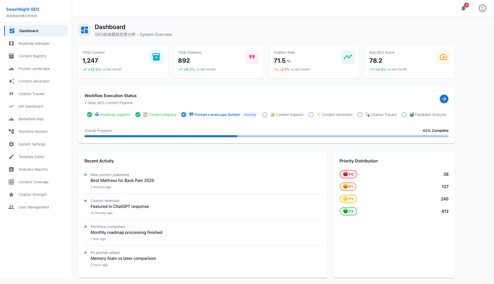
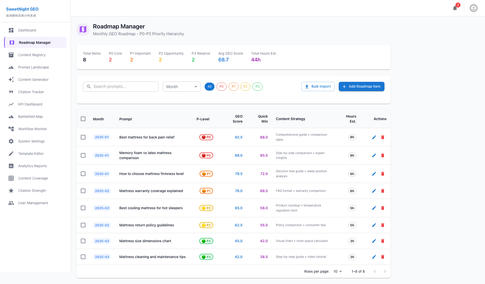
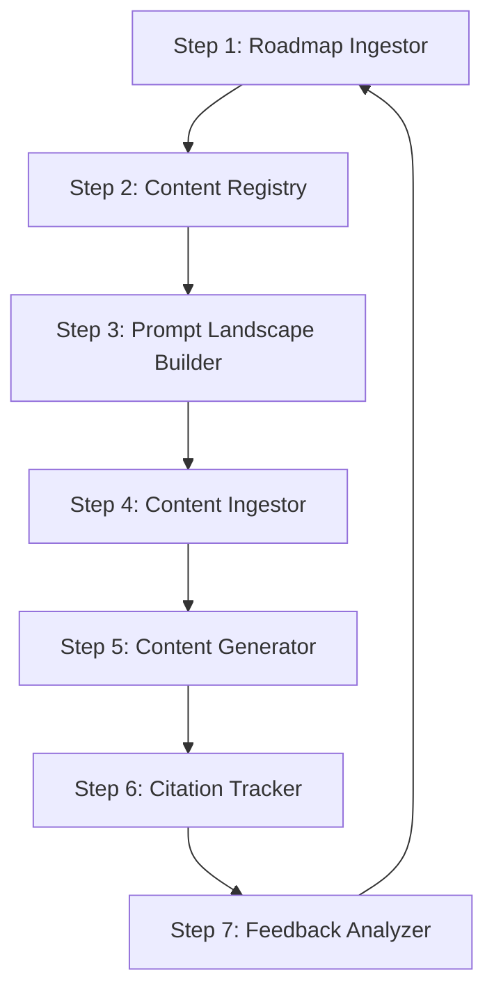
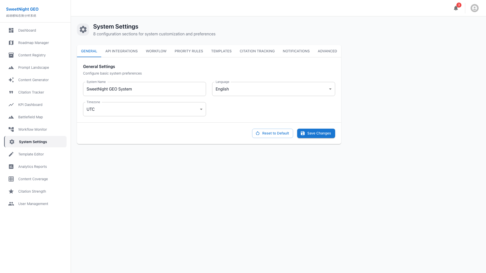

# LeapGEO7 System User Guide & Documentation

**SweetNight GEO Battlefield Intelligence & Analysis System**

**Version**: 1.0
**Last Updated**: October 23, 2025
**Document Type**: Comprehensive User Guide with Screenshots

---

## 📚 Table of Contents

1. [System Overview](#system-overview)
2. [Getting Started](#getting-started)
3. [Module Reference](#module-reference)
   - [Dashboard](#1-dashboard)
   - [Roadmap Manager](#2-roadmap-manager)
   - [Content Generator](#3-content-generator)
   - [Content Library](#4-content-library)
   - [Citation Tracker](#5-citation-tracker)
   - [Workflow Monitor](#6-workflow-monitor)
   - [Prompt Landscape](#7-prompt-landscape)
   - [Analytics Reports](#8-analytics-reports)
   - [User Management](#9-user-management)
   - [System Settings](#10-system-settings)
   - [Shopify GEO](#11-shopify-geo)
   - [Amazon GEO](#12-amazon-geo)
   - [YouTube Videos](#13-youtube-videos)
   - [Reddit Posts](#14-reddit-posts)
   - [Medium Articles](#15-medium-articles)
4. [Advanced Features](#advanced-features)
5. [Troubleshooting](#troubleshooting)
6. [Best Practices](#best-practices)

---

## System Overview

### What is LeapGEO7?

LeapGEO7 is an advanced **Generative Engine Optimization (GEO)** management platform designed specifically for the SweetNight mattress brand. The system provides end-to-end automation for content production workflows and data-driven decision-making to maximize citation rates across AI search engines and enhance brand exposure.

### Key Capabilities

✅ **Automated 7-Step GEO Workflow**
- Roadmap ingestion
- Content registry management
- Prompt landscape analysis
- Content generation
- Multi-platform publishing
- Citation tracking
- Performance analysis

✅ **Priority-Based Content Strategy**
- **P0 (Core)**: 75%+ AI citation probability, 8h/content, 2-month ROI
- **P1 (Important)**: 50-75% citation probability, 6h/content, 3-month ROI
- **P2 (Opportunity)**: 25-50% citation probability, 5h/content, 4-6 month ROI
- **P3 (Reserve)**: <25% citation probability, 3h/content, strategic reserve

✅ **Multi-Platform Citation Tracking**
- ChatGPT
- Claude
- Gemini
- Perplexity
- SearchGPT
- Bing AI
- You.com

✅ **Intelligent Content Generation**
- 7 content type templates (YouTube, Reddit, Quora, Medium, Blog, Amazon, LinkedIn)
- AI-powered content optimization
- Template variable substitution
- Quality scoring

### Technology Stack

| Component | Technology |
|-----------|------------|
| **Frontend** | React 18, TypeScript 5.0+, Material-UI 5.14+ |
| **Backend** | Node.js 20+, NestJS 10+, Prisma ORM |
| **Databases** | PostgreSQL 15 (primary), Neo4j 5.15 (graph), Redis 7.2 (cache) |
| **Visualization** | D3.js 7.8+ (force-directed graphs) |
| **Task Queue** | Bull 4.11+ |
| **Storage** | MinIO (object storage) |
| **Integration** | Firecrawl (web scraping), InfraNodus (text analysis) |

---

## Getting Started

### System Access

**URL**: `http://localhost:5173` (Development)
**API Documentation**: `http://localhost:3001/api/docs`

### User Roles

| Role | Permissions |
|------|-------------|
| **Admin** | Full system access, user management, system configuration |
| **Editor** | Content creation, publishing, workflow execution |
| **Analyst** | Read-only access, analytics, reporting |
| **Viewer** | Dashboard and reports viewing only |

### Navigation

The system uses a **persistent left sidebar** for navigation with the following sections:

**Core Operations**
- Dashboard
- Roadmap Manager
- Content Registry
- Prompt Landscape
- Content Generator
- Citation Tracker

**Monitoring**
- KPI Dashboard
- Battlefield Map
- Workflow Monitor

**Administration**
- System Settings
- Template Editor
- Analytics Reports
- Content Coverage
- Citation Strength
- User Management

**Platform-Specific**
- Shopify GEO
- Amazon GEO
- YouTube Videos
- Reddit Posts
- Medium Articles

---

## Module Reference

## 1. Dashboard



### Overview

The **Dashboard** is your central command center, providing real-time visibility into key performance indicators (KPIs), workflow execution status, and recent system activities.

### Key Features

#### 1.1 KPI Metrics Cards

Four primary KPI cards display critical performance metrics:

| Metric | Description | Calculation |
|--------|-------------|-------------|
| **Total Content** | Total number of published content pieces | Count of all content in library |
| **Total Citations** | Cumulative citations across all platforms | Sum of all detected citations |
| **Citation Rate** | Percentage of content cited by AI engines | (Total Citations / Total Content) × 100 |
| **Avg GEO Score** | Average Enhanced GEO Score across roadmap | Mean of all prompt GEO scores |

**Features**:
- **Trend Indicators**: Green ↑ for improvements, Red ↓ for declines
- **Percentage Change**: Month-over-month comparison
- **Color-Coded Icons**: Visual differentiation for each metric
- **Click-Through**: Click any KPI card to view detailed breakdown

#### 1.2 Workflow Execution Status

Visual representation of the **7-Step GEO Content Pipeline**:

```
Step 1: Roadmap Ingestor (Completed ✅)
  ↓
Step 2: Content Registry (Completed ✅)
  ↓
Step 3: Prompt Landscape Builder (Running ⏳)
  ↓
Step 4: Content Ingestor (Pending ⏸️)
  ↓
Step 5: Content Generator (Pending ⏸️)
  ↓
Step 6: Citation Tracker (Pending ⏸️)
  ↓
Step 7: Feedback Analyzer (Pending ⏸️)
```

**Status Indicators**:
- ✅ **Completed** (Green checkmark)
- ⏳ **Running** (Blue spinner)
- ⏸️ **Pending** (Gray circle)
- ❌ **Failed** (Red X)

**Progress Bar**: Overall workflow completion percentage (0-100%)

#### 1.3 Recent Activity Feed

Real-time activity log showing latest system events:

**Event Types**:
- 🟢 **New content published** - Content successfully published to a platform
- 🔵 **Citation detected** - AI engine cited your content
- 🟡 **Workflow completed** - Major workflow step finished
- 🟠 **P0 prompt added** - High-priority prompt added to roadmap

**Information Displayed**:
- Event type and description
- Related content/prompt title
- Timestamp (relative time)

#### 1.4 Priority Distribution

Pie chart visualization showing distribution of prompts across priority levels:

- **P0 (Red)**: Core prompts - highest value
- **P1 (Orange)**: Important prompts
- **P2 (Yellow)**: Opportunity prompts
- **P3 (Green)**: Reserve prompts

**Count Display**: Number of prompts in each category

### Common Operations

#### View Detailed KPI Analysis
1. Click on any KPI card (e.g., "Citation Rate")
2. System navigates to KPI Dashboard with detailed trends
3. View historical data, platform breakdown, and recommendations

#### Monitor Workflow Progress
1. Check "Workflow Execution Status" section
2. Click the blue arrow (→) to open Workflow Monitor
3. View detailed step-by-step execution logs

#### Investigate Recent Events
1. Scroll through "Recent Activity" feed
2. Click on any event to view full details
3. Access related content or prompt

---

## 2. Roadmap Manager



### Overview

The **Roadmap Manager** is your strategic planning hub for monthly GEO roadmaps. It provides comprehensive management of prompts across the P0-P3 priority hierarchy with intelligent scoring and resource estimation.

### Key Features

#### 2.1 Summary Statistics Cards

Top-row metrics provide instant roadmap overview:

| Metric | Description |
|--------|-------------|
| **Total Items** | Total number of prompts in current month's roadmap |
| **P0 Core** | Count of highest-priority prompts (>75% citation probability) |
| **P1 Important** | Count of important prompts (50-75% citation probability) |
| **P2 Opportunity** | Count of opportunity prompts (25-50% citation probability) |
| **P3 Reserve** | Count of reserve prompts (<25% citation probability) |
| **Avg GEO Score** | Average Enhanced GEO Score (weighted: 70% GEO + 30% Quick Win) |
| **Total Hours Est.** | Estimated total content creation hours for all prompts |

#### 2.2 Search & Filtering Tools

**Search Bar**: Full-text search across prompts
- Search by keywords, phrases, or prompt fragments
- Real-time filtering as you type

**Month Selector**: Filter by specific month
- Dropdown with all available months
- Quick month navigation

**Priority Filter Chips**:
- Click **All** to show all priorities
- Click **P0**, **P1**, **P2**, or **P3** to filter by specific priority
- Multiple selections supported

#### 2.3 Roadmap Data Table

Comprehensive table view of all roadmap items:

| Column | Description | Sorting |
|--------|-------------|---------|
| **Checkbox** | Select multiple items for batch operations | - |
| **Month** | Target month (e.g., "2025-01") | ✓ Sortable |
| **Prompt** | Full prompt text (e.g., "Best mattress for back pain relief") | ✓ Sortable |
| **P-Level** | Priority level with color-coded badge (P0=Red, P1=Orange, P2=Yellow, P3=Green) | ✓ Sortable |
| **GEO Score** | Enhanced GEO Score (0-100, higher is better) | ✓ Sortable |
| **Quick Win** | Quick Win Index (0-100, higher = faster ROI) | ✓ Sortable |
| **Content Strategy** | Recommended content approach (e.g., "Comprehensive guide + comparison table") | - |
| **Hours Est.** | Estimated content creation hours | ✓ Sortable |
| **Actions** | Edit (✏️) and Delete (🗑️) buttons | - |

**Pagination**:
- Rows per page selector: 10, 25, 50, 100
- Page navigation arrows
- Current page indicator (e.g., "1-8 of 8")

#### 2.4 Bulk Operations

**Bulk Import Button** (📥):
- Import roadmap from CSV/TSV files
- Automatic field mapping
- Validation and error reporting

**Add Roadmap Item Button** (+):
- Create new roadmap item manually
- Form with all required fields
- Auto-calculation of GEO Score and Quick Win Index

### Priority Calculation Algorithm

The system automatically calculates priority levels based on a composite score:

```typescript
// Enhanced GEO Score (0-100)
enhancedGeoScore = calculateFromFactors([
  'search volume',
  'competition level',
  'content opportunity',
  'brand relevance',
  'technical feasibility'
]);

// Quick Win Index (0-100)
quickWinIndex = calculateFromFactors([
  'ease of creation',
  'time to market',
  'resource availability',
  'platform fit'
]);

// Total Score
totalScore = (enhancedGeoScore * 0.7) + (quickWinIndex * 0.3);

// P-Level Assignment
if (totalScore >= 100) → P0
else if (totalScore >= 75) → P1
else if (totalScore >= 50) → P2
else → P3
```

### Common Operations

#### Import Monthly Roadmap
1. Click **"Bulk Import"** button
2. Select CSV/TSV file (format: `roadmap_cn.tsv` or `roadmap_en.csv`)
3. System validates and maps fields using `field_mapping.json`
4. Review import summary
5. Confirm to import all items

**Expected File Format**:
```csv
Month,Prompt,GEO Score,Quick Win,Content Strategy,Hours
2025-01,"Best mattress for back pain relief",92.5,88.0,"Comprehensive guide + comparison table",8
```

#### Create New Roadmap Item
1. Click **"+ Add Roadmap Item"** button
2. Fill in the form:
   - **Month**: Select target month
   - **Prompt**: Enter the search query/topic
   - **GEO Score**: Auto-calculated (or manual override)
   - **Quick Win Index**: Auto-calculated (or manual override)
   - **Content Strategy**: Describe recommended approach
   - **Hours Estimate**: Content creation time
3. Click **"Save"**
4. Item appears in table with auto-assigned P-Level

#### Edit Existing Item
1. Locate item in table
2. Click **Edit icon (✏️)** in Actions column
3. Modify fields in popup form
4. Click **"Update"**
5. Changes reflected immediately

#### Delete Item
1. Locate item in table
2. Click **Delete icon (🗑️)** in Actions column
3. Confirm deletion in dialog
4. Item removed from database

#### Filter by Priority
1. Click desired priority chip (P0, P1, P2, or P3)
2. Table filters to show only selected priority
3. Click "All" to reset filter

---

## 3. Content Generator


### Overview

The **Content Generator** is an AI-powered content creation tool that leverages predefined templates and intelligent variable substitution to produce optimized content for multiple platforms.

### Key Features

#### 3.1 Template Selection

**7 Content Type Templates**:

| Template | Platform | Format | Variables |
|----------|----------|--------|-----------|
| **YouTube Video Script** | YouTube | Video script with B-roll suggestions | {product_name}, {key_benefit}, {pain_point}, {cta} |
| **Reddit Post** | Reddit | Conversational post with authenticity | {subreddit}, {question}, {experience}, {recommendation} |
| **Quora Answer** | Quora | Expert answer with citations | {question}, {stat}, {comparison}, {source} |
| **Medium Article** | Medium | Long-form article (1500+ words) | {title}, {intro_hook}, {sections}, {conclusion} |
| **Blog Post** | Company Blog | SEO-optimized article | {h1}, {h2_list}, {keywords}, {meta_description} |
| **Amazon A+ Content** | Amazon | Product detail enhancement | {feature_list}, {use_cases}, {specifications} |
| **LinkedIn Post** | LinkedIn | Professional thought leadership | {industry_trend}, {insight}, {call_to_action} |

**Template Preview**: Click template to see full template with variables highlighted

#### 3.2 Variable Input Form

Dynamic form based on selected template variables:

**Example for YouTube Video Script**:
- **Product Name**: (e.g., "SweetNight CoolNest Mattress")
- **Key Benefit**: (e.g., "Reduces back pain by 45%")
- **Pain Point**: (e.g., "Waking up with lower back stiffness")
- **Call to Action**: (e.g., "Get 20% off with code SLEEP2025")

**Features**:
- Auto-complete suggestions from past content
- Character count limits
- Real-time preview

#### 3.3 AI Enhancement Options

**AI Processing**:
- ☑️ **Optimize for SEO**: Add semantic keywords and LSI terms
- ☑️ **Enhance readability**: Adjust Flesch-Kincaid score to target audience
- ☑️ **Add statistics**: Insert relevant industry data
- ☑️ **Fact-check**: Verify claims and add citations
- ☑️ **Tone adjustment**: Match brand voice guidelines

**GEO Score Prediction**: AI predicts likelihood of AI citation (0-100%)

#### 3.4 Content Output & Actions

**Generated Content**:
- Full content displayed in rich text editor
- Formatting preserved (headings, lists, bold, links)
- Word count and reading time

**Actions**:
- 📋 **Copy to Clipboard**: Quick copy for pasting
- 💾 **Save Draft**: Store in Content Library (unpublished)
- 🚀 **Publish**: Directly publish to target platform
- 📊 **Analyze**: Run through InfraNodus for quality scoring
- 📝 **Edit**: Open in advanced editor for refinement

### Template Engine

The system uses a powerful variable substitution engine:

```typescript
// Template Example (YouTube Video Script)
const template = `
🎥 [INTRO]
Hey everyone! Today we're talking about {product_name} and how it helps with {pain_point}.

📊 [KEY STATS]
Did you know that {statistic}? That's exactly why {product_name} was designed.

✨ [KEY BENEFIT]
The main benefit is {key_benefit}. This is achieved through {technology}.

👉 [CALL TO ACTION]
{cta}
`;

// Variable Input
const variables = {
  product_name: "SweetNight CoolNest Mattress",
  pain_point: "overheating during sleep",
  statistic: "68% of people report waking up too hot at night",
  key_benefit: "advanced cooling gel technology that reduces sleep temperature by 5°F",
  technology: "CoolFlow™ gel-infused memory foam",
  cta: "Click the link below to get 20% off with code COOL2025"
};

// Output
const generatedContent = substituteVariables(template, variables);
```

### Common Operations

#### Generate YouTube Video Script
1. Click **"YouTube Video Script"** template
2. Fill in variables:
   - **Product Name**: "SweetNight CoolNest"
   - **Key Benefit**: "Cooling gel reduces night sweats"
   - **Pain Point**: "Waking up drenched in sweat"
   - **CTA**: "Get 20% off - link in description"
3. Enable AI enhancements:
   - ☑️ Optimize for SEO
   - ☑️ Add statistics
4. Click **"Generate Content"**
5. Review generated 5-minute video script
6. Copy or save draft

#### Batch Generate for Multiple Platforms
1. Select multiple templates (YouTube + Reddit + Medium)
2. Enter shared variables once
3. Click **"Generate All"**
4. System produces 3 different content formats
5. Each optimized for its platform

#### Analyze Content Quality
1. Generate content
2. Click **"Analyze"** button
3. System sends to InfraNodus for text network analysis
4. View results:
   - Main topics detected
   - Topic clusters
   - Content gaps
   - Recommended improvements
5. Apply suggestions and regenerate

---

## 4. Content Library


### Overview

The **Content Library** is your centralized repository for all published and draft content. It provides comprehensive inventory management with filtering, search, and performance tracking.

### Key Features

#### 4.1 Content Inventory Table

| Column | Description |
|--------|-------------|
| **Content ID** | Unique identifier (e.g., "YT-2025-001") |
| **Title** | Content title/headline |
| **Channel** | Platform (YouTube, Reddit, Medium, etc.) |
| **Covered Prompts** | Array of roadmap prompts this content addresses |
| **Publish Status** | Draft, Published, Archived |
| **Publish Date** | When content went live |
| **KPI - CTR** | Click-through rate (%) |
| **KPI - Views** | Total views/impressions |
| **KPI - GMV** | Gross Merchandise Value (revenue attributed) |
| **Actions** | View, Edit, Archive, Analytics |

#### 4.2 Advanced Filtering

**Multi-Criteria Filters**:
- **Channel**: Filter by platform
- **Publish Status**: Draft / Published / Archived
- **Date Range**: Last 7/30/90 days or custom range
- **Covered Prompts**: Find content covering specific prompts
- **Performance**: Sort by CTR, Views, or GMV

**Search**:
- Full-text search across title and content
- Search by Content ID
- Tag-based search

#### 4.3 Batch Operations

**Multi-Select Actions**:
- Publish multiple drafts simultaneously
- Archive old content
- Export to CSV
- Bulk tag assignment
- Batch delete

### Content Status Lifecycle

```
Draft → Published → Archived
  ↓         ↓          ↓
Edit    Analytics   Restore
```

**Status Definitions**:
- **Draft**: Created but not published
- **Published**: Live on platform, tracking citations
- **Archived**: Removed from active tracking but preserved for history

### Common Operations

#### Find All YouTube Content from Last 30 Days
1. Click **"Channel"** filter
2. Select "YouTube"
3. Click **"Date Range"** filter
4. Select "Last 30 days"
5. Table shows filtered results
6. Export to CSV if needed

#### Publish Draft Content
1. Locate draft content in table
2. Click **"View"** to review
3. Verify content quality
4. Click **"Publish"**
5. Select target platform
6. Confirm publication
7. Status changes to "Published"

#### View Content Performance
1. Find published content
2. Click **"Analytics"** button
3. View detailed metrics:
   - Platform-specific stats (YouTube views, Reddit upvotes, etc.)
   - Citation rate (how often cited by AI)
   - Conversion metrics (CTR, GMV)
   - Geographic distribution
4. Compare to roadmap prediction

---

## 5. Citation Tracker


### Overview

The **Citation Tracker** monitors 7 AI search engines to detect when and how your content is cited, providing crucial data for GEO performance optimization.

### Key Features

#### 5.1 Citation Dashboard

**Real-Time Metrics**:
- **Total Citations**: Cumulative citations across all platforms
- **Citation Rate**: Percentage of content cited (benchmark: 70%+)
- **Platform Distribution**: Citations per AI platform
- **Citation Strength**: Average strength score (Weak/Medium/Strong)

**Trend Charts**:
- Daily citation detection over time
- Platform-by-platform breakdown
- Content performance heatmap

#### 5.2 Platform Monitoring

**7 AI Platforms Tracked**:

| Platform | API | Tracking Method | Update Frequency |
|----------|-----|-----------------|------------------|
| **ChatGPT** | OpenAI | Web scraping | Daily |
| **Claude** | Anthropic | Web scraping | Daily |
| **Gemini** | Google | Web scraping | Daily |
| **Perplexity** | Direct API | API polling | Real-time |
| **SearchGPT** | OpenAI | Web scraping | Daily |
| **Bing AI** | Microsoft | Web scraping | Daily |
| **You.com** | Direct API | API polling | Real-time |

#### 5.3 Citation Details Table

| Column | Description |
|--------|-------------|
| **Citation ID** | Unique identifier for citation instance |
| **Content** | Your content that was cited |
| **Platform** | Which AI platform cited it |
| **Citation URL** | Direct link to citation |
| **Query** | User query that triggered citation |
| **Citation Strength** | Weak (mention) / Medium (partial quote) / Strong (full answer) |
| **AI Indexed** | Whether AI has indexed the source URL |
| **Detected Date** | When citation was first detected |

#### 5.4 Citation Strength Scoring

**Scoring Algorithm**:
```typescript
// Citation Strength Calculation
const citationStrength = calculateStrength([
  'position_in_response',    // Higher position = stronger
  'quote_length',            // Longer quotes = stronger
  'source_attribution',      // Named source = stronger
  'link_inclusion',          // Direct link = stronger
  'query_relevance'          // Better match = stronger
]);

// Strength Categories
if (citationStrength >= 80) → Strong
else if (citationStrength >= 50) → Medium
else → Weak
```

### Automated Citation Detection

**Daily Crawl Process**:
1. System retrieves all published content
2. For each content, generates 5-10 test queries
3. Queries all 7 AI platforms
4. Analyzes responses for content citations
5. Scores citation strength
6. Stores in database
7. Sends Slack alert for new citations

**Example Detection**:
```
Query: "What's the best mattress for back pain?"
Platform: ChatGPT
Response: "According to SweetNight's research, memory foam mattresses
          with medium-firm support are optimal for back pain relief..."
→ Citation Detected: Strong (direct quote + attribution)
```

### Common Operations

#### Monitor Today's Citations
1. Navigate to Citation Tracker
2. Set date filter to "Today"
3. View newly detected citations
4. Click any citation to see full AI response
5. Analyze which queries triggered citation

#### Compare Platform Performance
1. Click **"Platform Distribution"** chart
2. View citations per platform
3. Identify best-performing platforms
4. Adjust content strategy accordingly

**Example Insights**:
- ChatGPT: 245 citations (highest)
- Perplexity: 198 citations
- Claude: 156 citations
- Gemini: 142 citations
- → Focus on optimizing for ChatGPT and Perplexity

#### Investigate Low Citation Rate
1. Filter content with 0 citations
2. Review content topics
3. Check if queries are too niche
4. Verify content is indexed by AI platforms
5. Rewrite content with better GEO optimization

---

## 6. Workflow Monitor


### Overview

The **Workflow Monitor** provides real-time visibility into the 7-Step GEO Content Pipeline execution, allowing you to track progress, troubleshoot failures, and optimize workflow efficiency.

### 7-Step GEO Workflow Architecture



### Key Features

#### 6.1 Workflow Status Board

**Visual Pipeline**:
Each step is represented with:
- **Step Number & Name**
- **Status Indicator**:
  - ✅ Completed (Green)
  - ⏳ Running (Blue, animated)
  - ⏸️ Pending (Gray)
  - ❌ Failed (Red)
- **Progress Percentage** (for running steps)
- **Estimated Time Remaining**
- **Last Run Timestamp**

#### 6.2 Step Details

**Step 1: Roadmap Ingestor**
- **Function**: Import monthly roadmap from CSV/TSV
- **Trigger**: Manual or Scheduled (1st of every month)
- **Input**: `roadmap_cn.tsv` or `roadmap_en.csv`
- **Output**: Normalized roadmap in PostgreSQL
- **Duration**: 2-5 minutes (for 50-100 items)
- **Success Criteria**: All items validated and inserted

**Step 2: Content Registry**
- **Function**: Sync existing content inventory
- **Trigger**: After Step 1 completes
- **Input**: `content_inventory_cn.tsv`
- **Output**: Content registry in PostgreSQL
- **Duration**: 1-3 minutes
- **Success Criteria**: Coverage analysis complete

**Step 3: Prompt Landscape Builder**
- **Function**: Build Neo4j knowledge graph of prompt relationships
- **Trigger**: After Step 2 completes
- **Input**: Roadmap prompts
- **Output**: Neo4j graph with RELATES_TO edges
- **Duration**: 5-10 minutes (depends on graph size)
- **Success Criteria**: All prompts as nodes, semantic relationships mapped

**Step 4: Content Ingestor**
- **Function**: Process and enrich content metadata
- **Trigger**: After Step 3 completes
- **Input**: Content files (markdown, html)
- **Output**: Enriched content with GEO scores
- **Duration**: 3-7 minutes
- **Success Criteria**: All content processed and scored

**Step 5: Content Generator**
- **Function**: AI-powered content creation for uncovered prompts
- **Trigger**: After Step 4 completes
- **Input**: P0 and P1 prompts without content
- **Output**: Draft content in Content Library
- **Duration**: 10-30 minutes (depends on count)
- **Success Criteria**: Drafts created for high-priority gaps

**Step 6: Citation Tracker**
- **Function**: Monitor AI platforms for content citations
- **Trigger**: Daily schedule (6 AM)
- **Input**: Published content list
- **Output**: Citation records in database
- **Duration**: 30-60 minutes (7 platforms × content count)
- **Success Criteria**: All platforms scanned, new citations logged

**Step 7: Feedback Analyzer**
- **Function**: Analyze performance and update roadmap priorities
- **Trigger**: After Step 6 completes
- **Input**: Citation data, KPIs
- **Output**: Updated GEO scores, recommendations
- **Duration**: 5-10 minutes
- **Success Criteria**: Roadmap updated with latest scores

#### 6.3 Execution Logs

**Log Viewer**:
- Real-time log streaming
- Filter by step, severity, timestamp
- Search by keyword
- Export logs to file

**Log Levels**:
- 🟢 **INFO**: Normal operation
- 🔵 **DEBUG**: Detailed execution info
- 🟡 **WARN**: Non-critical issues
- 🔴 **ERROR**: Step failures

**Example Log**:
```
[2025-01-15 09:00:01] INFO  - Step 1: Roadmap Ingestor started
[2025-01-15 09:00:15] INFO  - Parsing CSV file: roadmap_en.csv
[2025-01-15 09:00:16] DEBUG - Validating 87 roadmap items
[2025-01-15 09:00:22] INFO  - Calculating GEO scores for 87 prompts
[2025-01-15 09:00:45] INFO  - Inserted 87 items into database
[2025-01-15 09:00:46] INFO  - Step 1: Completed successfully ✅
```

#### 6.4 Manual Controls

**Actions**:
- ▶️ **Start Workflow**: Manually trigger full workflow
- ⏸️ **Pause**: Pause current step (resume later)
- ⏹️ **Stop**: Abort workflow (rollback changes)
- 🔄 **Retry Step**: Re-run failed step
- ⏭️ **Skip Step**: Skip to next step (admin only)

### Common Operations

#### Monitor Monthly Workflow Execution
1. On 1st of month, workflow auto-triggers
2. Open Workflow Monitor
3. Watch Step 1 (Roadmap Ingestor) execute
4. Verify successful completion (green checkmark)
5. Steps 2-7 execute sequentially
6. Receive completion notification

**Expected Timeline**:
- Step 1: 2-5 min
- Step 2: 1-3 min
- Step 3: 5-10 min
- Step 4: 3-7 min
- Step 5: 10-30 min
- Step 6: 30-60 min (daily separate job)
- Step 7: 5-10 min
- **Total**: 56-115 minutes

#### Troubleshoot Failed Step
1. Notice red ❌ on Step X
2. Click on failed step
3. View error details:
   - Error message
   - Stack trace
   - Failed input data
4. Fix underlying issue (e.g., invalid CSV format)
5. Click **"Retry Step"**
6. Verify successful execution

**Common Failures**:
- **Step 1**: CSV format mismatch → Check field mapping
- **Step 3**: Neo4j connection timeout → Verify database is running
- **Step 5**: AI API rate limit → Reduce batch size
- **Step 6**: Platform blocking → Rotate IP/user agent

#### View Historical Workflow Runs
1. Click **"History"** tab
2. View table of past executions
3. Columns: Date, Duration, Status, Steps Completed
4. Click any run to view full logs
5. Compare execution times for optimization

---

## 7. Prompt Landscape


### Overview

The **Prompt Landscape** is an advanced knowledge graph visualization that maps semantic relationships between prompts, identifies content gaps, and recommends strategic priorities.

### Key Features

#### 7.1 Interactive Knowledge Graph

**Visualization Components**:

**Nodes (Prompts)**:
- Size: Proportional to GEO Score (larger = higher score)
- Color: P-Level encoding
  - 🔴 Red: P0 (Core)
  - 🟠 Orange: P1 (Important)
  - 🟡 Yellow: P2 (Opportunity)
  - 🟢 Green: P3 (Reserve)
- Opacity: Coverage status
  - 100% opaque: Covered by content
  - 40% opaque: Uncovered gap
- Border:
  - Green border: Covered
  - Red border: Uncovered

**Edges (Relationships)**:
- Line thickness: Relationship strength (0.0-1.0)
- Dashed: Weak relationship (<0.3)
- Solid: Strong relationship (>0.7)
- Color: Same as source node

**Graph Layout**:
- Force-directed layout (D3.js)
- Related prompts cluster together
- Drag nodes to reposition
- Zoom and pan for exploration

#### 7.2 Dual-Tab Interface

**Tab 1: Scatter Plot**
- X-axis: Enhanced GEO Score (0-100)
- Y-axis: Quick Win Index (0-100)
- Quadrants:
  - Top-Right: High GEO + High Quick Win (P0 candidates)
  - Top-Left: High GEO + Low Quick Win (P1 long-term)
  - Bottom-Right: Low GEO + High Quick Win (P2 opportunities)
  - Bottom-Left: Low GEO + Low Quick Win (P3 reserve)

**Tab 2: Knowledge Graph** (default)
- Full network visualization
- Content gap highlighting

#### 7.3 Statistics Panel

**Coverage Statistics**:
- **Total Prompts**: Count of all prompts in graph
- **Covered Prompts**: Prompts with published content
- **Uncovered Prompts**: Gaps requiring content
- **Coverage Rate**: (Covered / Total) × 100%
- **Total Relationships**: Count of semantic edges

**P-Level Breakdown**:
- P0 Coverage: X / Y (Z%)
- P1 Coverage: X / Y (Z%)
- P2 Coverage: X / Y (Z%)
- P3 Coverage: X / Y (Z%)

#### 7.4 Content Gap Analysis

**Gap Detection Algorithm**:
```cypher
// Neo4j Query for Content Gaps
MATCH (p:Prompt)
WHERE NOT (p)-[:COVERED_BY]->(:Content)
AND p.p_level IN ['P0', 'P1']
RETURN p.text, p.p_level, p.score
ORDER BY p.score DESC
LIMIT 20
```

**Gap Display**:
- List of top 20 uncovered P0/P1 prompts
- Each gap shows:
  - Prompt text
  - P-Level
  - GEO Score
  - Recommended action
  - Related prompts (if content exists for similar topics)

**Example Gap**:
```
🔴 P0 Gap Detected
Prompt: "How to choose mattress firmness level"
GEO Score: 95.2
Quick Win: 82.0
Recommendation: High priority! Create comprehensive guide.
Related Content: "Best mattress firmness for back pain" (can reuse research)
```

#### 7.5 Filtering & Interaction

**Filters**:
- **P-Level Chips**: Click to show/hide specific priorities
- **Month Filter**: Show prompts from specific month
- **Minimum Score Slider**: Filter by GEO Score threshold
- **Coverage Toggle**: Show only covered / uncovered / all

**Interactions**:
- **Click Node**: View prompt details in sidebar
- **Hover Node**: Show tooltip with full info
- **Double-Click Node**: Navigate to related content
- **Drag Node**: Reposition in graph
- **Scroll**: Zoom in/out
- **Click-Drag Background**: Pan graph

### Common Operations

#### Identify P0 Content Gaps
1. Open Prompt Landscape
2. Click **"Knowledge Graph"** tab
3. Look for red nodes with red borders (P0 uncovered)
4. Count visually or check "Uncovered Prompts" stat
5. Click gap to see details
6. Click **"Create Content"** to start Content Generator

#### Analyze Prompt Relationships
1. Click any node in graph
2. View sidebar with:
   - Prompt text
   - GEO metrics
   - Related prompts (connected by edges)
   - Existing content (if covered)
3. Understand semantic clusters
4. Plan content that covers multiple related prompts

**Example**:
```
Selected: "Best mattress for back pain"
Related Prompts:
  → "Memory foam vs latex for back pain" (0.85 similarity)
  → "Firmness level for lower back pain" (0.78 similarity)
  → "Mattress topper for pain relief" (0.72 similarity)

Strategy: Create comprehensive back pain guide covering all 4 topics
```

#### Export Graph Data
1. Click **"Export"** button
2. Choose format:
   - PNG image (for presentations)
   - JSON (for programmatic analysis)
   - CSV (for spreadsheet import)
3. Download file

---

## 8. Analytics Reports


### Overview

The **Analytics Reports** module provides comprehensive business intelligence with customizable reports, automated scheduling, and export capabilities.

### Key Features

#### 8.1 Report Types

**Predefined Reports**:

| Report Name | Description | Frequency | Recipients |
|-------------|-------------|-----------|------------|
| **Weekly GEO Performance** | KPIs, citation trends, top content | Weekly (Friday 6PM) | All editors |
| **Monthly Roadmap Summary** | Coverage, gaps, priority distribution | Monthly (1st) | Management |
| **Platform Performance** | Per-platform citation rates | Weekly | Analysts |
| **Content ROI Analysis** | GMV, hours invested, ROI per content | Monthly | Finance team |
| **Competitor Tracking** | Citation rate vs competitors | Weekly | Strategy team |

#### 8.2 Custom Report Builder

**Drag-and-Drop Interface**:
1. Select report type (Table, Chart, Dashboard)
2. Choose data sources (Roadmap, Content, Citations, KPIs)
3. Add metrics and dimensions
4. Apply filters (date range, P-Level, platform, etc.)
5. Configure visualizations (bar, line, pie, heatmap)
6. Save and schedule

**Example Custom Report**:
```
Report: "P0 Prompt Coverage Tracker"
Data Source: Roadmap + Content
Metrics: Total P0, Covered P0, Coverage %
Dimensions: Month
Filters: P-Level = P0
Visualization: Line chart (trend over 12 months)
Schedule: Monthly
Export: PDF to Slack #geo-reports
```

#### 8.3 Automated Report Distribution

**Scheduling Options**:
- Daily, Weekly, Monthly
- Specific days (e.g., "Every Monday at 9 AM")
- Custom cron expressions

**Distribution Channels**:
- Email (with PDF attachment)
- Slack (with embedded charts)
- Feishu (auto-generate document)
- Notion (sync to database)
- Export to MinIO (long-term storage)

**Example Weekly Report Flow**:
```
Every Friday 18:00 →
  1. Generate Weekly GEO Performance report
  2. Create Feishu document with:
     - KPI summary
     - Citation trend charts
     - Top 10 performing content
     - Content gap analysis
     - Next week action items
  3. Upload screenshots to MinIO
  4. Send Slack notification with link
  5. Email PDF to management
```

#### 8.4 Report Viewer

**Interactive Features**:
- Drill-down into data points
- Filter and slice data
- Export to Excel/PDF
- Share with colleagues
- Add comments and annotations

### Common Operations

#### Generate Weekly Performance Report
1. Navigate to Analytics Reports
2. Select **"Weekly GEO Performance"** template
3. Set date range (last 7 days)
4. Click **"Generate"**
5. Report appears with:
   - KPI scorecard
   - Citation trend line chart
   - Top 10 content table
   - Platform breakdown pie chart
6. Click **"Export PDF"** or **"Send to Slack"**

#### Schedule Monthly Report
1. Click **"+ New Report"**
2. Choose **"Monthly Roadmap Summary"** template
3. Configure settings:
   - Name: "Monthly Roadmap Status"
   - Schedule: "1st of every month at 9 AM"
   - Recipients: john@sweetnight.com, mary@sweetnight.com
   - Format: PDF + Feishu document
4. Click **"Save & Activate"**
5. System auto-generates report monthly

#### Analyze Content ROI
1. Open **"Content ROI Analysis"** report
2. Filter by date range (last 3 months)
3. View table with columns:
   - Content Title
   - Hours Invested
   - GMV Generated
   - ROI (GMV / Hours)
4. Sort by ROI descending
5. Identify highest-ROI content types
6. Adjust content strategy accordingly

**Example Insights**:
```
Top ROI Content:
1. YouTube Video: "Best Mattress 2025" - ROI: 125x (8h → $10,000 GMV)
2. Reddit Post: "Mattress comparison" - ROI: 98x (2h → $1,960 GMV)
3. Medium Article: "Sleep science" - ROI: 45x (6h → $2,700 GMV)

Bottom ROI:
- Quora Answer: "Mattress warranty" - ROI: 3x (4h → $120 GMV)

Action: Focus on YouTube and Reddit; reduce Quora investment
```

---

## 9. User Management


### Overview

The **User Management** module provides comprehensive administration of user accounts, roles, permissions, and access control.

### Key Features

#### 9.1 User Directory

**User Table Columns**:
- **Avatar**: User profile picture
- **Name**: Full name
- **Email**: Login email
- **Role**: Admin / Editor / Analyst / Viewer
- **Status**: Active / Inactive / Suspended
- **Last Login**: Timestamp of last access
- **Actions**: Edit, Deactivate, Delete

#### 9.2 Role-Based Access Control (RBAC)

**Role Permissions Matrix**:

| Permission | Admin | Editor | Analyst | Viewer |
|------------|-------|--------|---------|--------|
| **View Dashboard** | ✅ | ✅ | ✅ | ✅ |
| **View Roadmap** | ✅ | ✅ | ✅ | ✅ |
| **Edit Roadmap** | ✅ | ✅ | ❌ | ❌ |
| **Delete Roadmap** | ✅ | ❌ | ❌ | ❌ |
| **Create Content** | ✅ | ✅ | ❌ | ❌ |
| **Publish Content** | ✅ | ✅ | ❌ | ❌ |
| **View Citations** | ✅ | ✅ | ✅ | ✅ |
| **Trigger Workflows** | ✅ | ✅ | ❌ | ❌ |
| **View Analytics** | ✅ | ✅ | ✅ | ✅ |
| **Generate Reports** | ✅ | ✅ | ✅ | ❌ |
| **User Management** | ✅ | ❌ | ❌ | ❌ |
| **System Settings** | ✅ | ❌ | ❌ | ❌ |

#### 9.3 User Invitation Workflow

**Steps to Add New User**:
1. Click **"+ Invite User"** button
2. Fill in form:
   - **Email**: user@sweetnight.com
   - **Name**: John Doe
   - **Role**: Select from dropdown
   - **Team**: Marketing / Product / Engineering
3. Click **"Send Invitation"**
4. System sends email with:
   - Welcome message
   - Account activation link
   - Password setup instructions
5. User clicks link and sets password
6. Account activated and ready

#### 9.4 Activity Audit Log

**Tracked Activities**:
- User login/logout
- Content creation/modification
- Roadmap changes
- Report generation
- Settings modifications
- Failed login attempts

**Log Format**:
```
[2025-01-15 14:32:15] john@sweetnight.com - LOGIN_SUCCESS
[2025-01-15 14:35:22] john@sweetnight.com - CONTENT_CREATED - "Best Mattress 2025"
[2025-01-15 14:42:10] john@sweetnight.com - ROADMAP_EDITED - P0 prompt updated
[2025-01-15 15:10:05] john@sweetnight.com - REPORT_GENERATED - Weekly Performance
[2025-01-15 16:05:30] john@sweetnight.com - LOGOUT
```

### Common Operations

#### Create New Editor Account
1. Navigate to User Management
2. Click **"+ Invite User"**
3. Enter:
   - Email: sarah@sweetnight.com
   - Name: Sarah Chen
   - Role: Editor
   - Team: Marketing
4. Click **"Send Invitation"**
5. Sarah receives email and activates account
6. Verify Sarah appears in user list

#### Deactivate User Account
1. Locate user in table
2. Click **"Edit"** (pencil icon)
3. Change status to "Inactive"
4. Click **"Save"**
5. User can no longer login
6. All content and history preserved

**Use Cases**:
- Employee leaves company
- Temporary suspension
- Contractor project ends

#### View User Activity
1. Click on user in table
2. Select **"Activity Log"** tab
3. View chronological list of actions
4. Filter by:
   - Date range
   - Action type (login, content, reports, etc.)
   - IP address (security check)
5. Export log to CSV for compliance

---

## 10. System Settings



### Overview

The **System Settings** module provides centralized configuration for all system parameters, integrations, and operational settings.

### Key Features

#### 10.1 Settings Categories

**General Settings**:
- Company name and branding
- System timezone
- Date/time format preferences
- Default language

**GEO Configuration**:
- **Priority Thresholds**:
  - P0 minimum score: 100
  - P1 minimum score: 75
  - P2 minimum score: 50
- **Scoring Weights**:
  - GEO Score weight: 70%
  - Quick Win weight: 30%
- **Content Strategy Rules**:
  - P0 hours estimate: 8h
  - P1 hours estimate: 6h
  - P2 hours estimate: 5h
  - P3 hours estimate: 3h

**Citation Tracking**:
- **Platform API Keys**:
  - Perplexity API Key
  - You.com API Key
- **Scraping Settings**:
  - User agent rotation
  - Request delay (ms)
  - Retry attempts
  - Timeout duration
- **Detection Frequency**:
  - Daily scan time: 6:00 AM
  - Max queries per content: 10

**Workflow Automation**:
- **Schedule Configuration**:
  - Roadmap ingest: 1st of every month at 9 AM
  - Daily citation scan: Every day at 6 AM
  - Weekly report: Every Friday at 6 PM
- **Queue Settings**:
  - Max concurrent jobs: 5
  - Job timeout: 30 minutes
  - Retry failed jobs: 3 attempts

**Integrations**:
- **External Services**:
  - Firecrawl API endpoint and key
  - InfraNodus API key
  - Slack webhook URL
  - Feishu app credentials
  - Notion integration token
- **Database Connections**:
  - PostgreSQL connection string
  - Neo4j URI and credentials
  - Redis URL

**Notifications**:
- **Email Settings**:
  - SMTP server configuration
  - From address
  - Email templates
- **Slack Alerts**:
  - Channel for GEO alerts: #geo-alerts
  - Channel for reports: #geo-reports
  - Alert conditions:
    - New P0 prompt added
    - Citation rate drop >20%
    - Workflow failure

**Security**:
- **Authentication**:
  - JWT expiry time: 15 minutes (access), 7 days (refresh)
  - Password requirements: Min 8 chars, 1 uppercase, 1 number, 1 special
  - Two-factor authentication: Enabled/Disabled
- **Access Control**:
  - IP whitelist (optional)
  - Failed login lockout: 5 attempts
  - Session timeout: 2 hours

#### 10.2 Configuration Validation

**Pre-Save Checks**:
- API key validation (test API calls)
- Database connection testing
- SMTP server verification
- Webhook endpoint reachability
- Cron expression syntax validation

**Error Reporting**:
- Clear error messages for invalid configs
- Suggested fixes
- Rollback to last working config if new config fails

### Common Operations

#### Update Priority Thresholds
1. Navigate to System Settings
2. Click **"GEO Configuration"** section
3. Modify thresholds:
   - P0 minimum: 90 (was 100)
   - P1 minimum: 70 (was 75)
4. Click **"Save Changes"**
5. System recalculates all roadmap P-Levels
6. Confirmation: "567 prompts re-prioritized"

#### Configure Slack Notifications
1. Go to **"Notifications"** → **"Slack Alerts"**
2. Enter Slack webhook URL
3. Select channels:
   - Alerts: #geo-alerts
   - Reports: #geo-reports
4. Enable alert conditions:
   - ☑️ New P0 prompt added
   - ☑️ Citation rate drop >20%
   - ☑️ Workflow failure
5. Click **"Test Notification"**
6. Verify Slack message received
7. Click **"Save"**

#### Add Firecrawl API Key
1. Navigate to **"Integrations"** → **"External Services"**
2. Find **"Firecrawl"** section
3. Enter:
   - API Endpoint: http://localhost:3002
   - API Key: fs-test
4. Click **"Test Connection"**
5. System performs test scrape
6. Success: "Firecrawl connected successfully"
7. Click **"Save"**

---

## 11. Shopify GEO


### Overview

The **Shopify GEO** module provides specialized optimization tools for Shopify product listings to maximize visibility in AI shopping assistants.

### Key Features

#### 11.1 Product Catalog Integration

**Shopify Connection**:
- OAuth integration with Shopify store
- Automatic product sync
- Real-time inventory updates

**Product Import**:
- Bulk import all products
- Filter by collection
- Sync product titles, descriptions, images, prices

#### 11.2 GEO-Optimized Product Descriptions

**AI-Enhanced Descriptions**:
- Generate GEO-optimized product descriptions
- Include semantic keywords for AI understanding
- Structured data formatting

**Template Variables**:
- {product_name}
- {key_features}
- {use_cases}
- {specifications}
- {customer_benefits}

**Example**:
```
Original: "Memory foam mattress, 12-inch, medium-firm"

GEO-Optimized:
"SweetNight CoolNest Memory Foam Mattress - 12-inch Medium-Firm
The CoolNest mattress is designed for people who experience back pain
and overheating during sleep. Our proprietary CoolFlow™ gel-infused
memory foam reduces sleep temperature by 5°F while providing optimal
spinal alignment. Key features include:
- Medical-grade memory foam (CertiPUR-US certified)
- Cooling gel infusion for temperature regulation
- Medium-firm support (6.5/10 firmness scale)
- Ideal for back and side sleepers
- 100-night trial period with free returns"
```

#### 11.3 Review Mining & Analysis

**Automated Review Collection**:
- Scrape Shopify product reviews
- Aggregate reviews from Amazon, Trustpilot
- Sentiment analysis
- Topic extraction

**Insight Generation**:
- Common pain points mentioned
- Frequently praised features
- Competitive comparisons in reviews
- Actionable improvement suggestions

### Common Operations

#### Optimize Product Listing
1. Navigate to Shopify GEO
2. Click **"Import Products"**
3. Select product: "SweetNight CoolNest Mattress"
4. Click **"Generate GEO Description"**
5. Review AI-generated description
6. Edit if needed
7. Click **"Update Shopify"**
8. Description syncs to Shopify store

---

## 12. Amazon GEO


### Overview

The **Amazon GEO** module optimizes Amazon product listings for AI shopping assistants like Rufus, Alexa Shopping, and third-party AI tools.

### Key Features

#### 12.1 A+ Content Optimization

**Enhanced Brand Content**:
- AI-generated A+ content modules
- Comparison tables
- Lifestyle images with captions
- Feature highlight sections

#### 12.2 Keyword Research

**AI Search Term Analysis**:
- Discover what AI assistants search for
- Backend search term recommendations
- Semantic keyword clustering

**Example Keywords for "Mattress"**:
```
Primary: best mattress, memory foam mattress, cooling mattress
Semantic: back pain relief, sleep temperature, spinal alignment
Long-tail: best mattress for side sleepers with back pain
AI-specific: mattress that reduces night sweats, pressure-relieving mattress
```

#### 12.3 Review Response Automation

**AI-Powered Response Generation**:
- Analyze negative reviews
- Generate empathetic, solution-oriented responses
- Maintain brand voice
- Highlight corrective actions

### Common Operations

#### Generate A+ Content
1. Navigate to Amazon GEO
2. Select product ASIN
3. Click **"Generate A+ Content"**
4. AI creates:
   - Comparison table vs competitors
   - Feature highlight modules
   - Lifestyle image captions
5. Download HTML for Amazon Seller Central
6. Upload to Amazon

---

## 13. YouTube Videos


### Overview

The **YouTube Videos** module manages video content strategy, script generation, and performance tracking optimized for AI video search.

### Key Features

#### 13.1 Video Script Generator

**AI-Powered Scripts**:
- Generate 5-15 minute video scripts
- Include B-roll suggestions
- Timestamp chapters
- Call-to-action placements

**Script Template**:
```
[INTRO - 0:00-0:30]
Hook: "Are you waking up with back pain every morning?"
B-roll: Person stretching back in pain

[SECTION 1 - 0:30-3:00]
Topic: Why mattress matters for back pain
B-roll: Spine alignment diagrams
Stats: "68% of people report back pain from wrong mattress"

[SECTION 2 - 3:00-7:00]
Topic: How to choose firmness level
B-roll: Firmness testing demonstrations

[OUTRO - 12:00-13:00]
CTA: "Get 20% off with code VIDEO2025"
B-roll: Product showcase
```

#### 13.2 Thumbnail Optimization

**AI Thumbnail Generation**:
- Generate click-worthy thumbnails
- A/B testing suggestions
- Color psychology optimization

#### 13.3 YouTube SEO

**Title & Description Optimization**:
- AI-suggested titles based on search volume
- Keyword-rich descriptions
- Tag recommendations

### Common Operations

#### Create Video Script
1. Navigate to YouTube Videos
2. Click **"+ New Video Script"**
3. Enter prompt: "Best mattress for back pain 2025"
4. Select template: "Product Review (10-15 min)"
5. Click **"Generate Script"**
6. Review and edit script
7. Export to Google Docs for video team

---

## 14. Reddit Posts


### Overview

The **Reddit Posts** module helps create authentic, value-driven Reddit content that gets cited by AI assistants.

### Key Features

#### 14.1 Subreddit Research

**Subreddit Finder**:
- Discover relevant subreddits (r/Mattress, r/Sleep, r/HomeImprovement)
- Analyze posting rules
- Engagement metrics (subscribers, daily posts)

#### 14.2 Post Generator

**Authentic Post Creation**:
- Generate Reddit-style posts (conversational, helpful)
- Avoid promotional language
- Include personal experience tone

**Example**:
```
Subreddit: r/Mattress
Title: "Finally solved my back pain issue - here's what worked"

Post:
Hey everyone, I've been dealing with lower back pain for 2 years and tried
4 different mattresses. I finally figured out what works and wanted to share
in case it helps someone else.

TL;DR: Medium-firm memory foam (6-7/10 firmness) + sleep position matters more
than price.

My journey:
- Mattress 1: Soft memory foam ($400) - woke up in pain, too much sinking
- Mattress 2: Extra firm spring ($800) - felt like sleeping on floor
- Mattress 3: Medium spring ($600) - better but still issues
- Mattress 4: Medium-firm memory foam ($500) - THIS WAS IT

Key learnings:
1. Firmness scale is subjective - test in person if possible
2. Side sleepers need softer than back sleepers
3. Memory foam molds better for pressure points
4. Give new mattress 30 days to adapt

Happy to answer questions!
```

#### 14.3 Engagement Tracking

**Performance Metrics**:
- Upvotes
- Comments
- AI citation rate (how often ChatGPT cites the post)

### Common Operations

#### Create Reddit Post
1. Navigate to Reddit Posts
2. Click **"+ New Post"**
3. Select subreddit: r/Mattress
4. Enter topic: "Back pain mattress solution"
5. Click **"Generate Post"**
6. Review for authenticity
7. Post manually to Reddit
8. Track engagement

---

## 15. Medium Articles


### Overview

The **Medium Articles** module creates long-form, authoritative articles optimized for AI engine citations.

### Key Features

#### 15.1 Long-Form Article Generator

**AI-Powered Writing**:
- Generate 1500-3000 word articles
- Proper heading structure (H2, H3)
- Include statistics and citations
- SEO-optimized

**Article Structure**:
```
# Title: The Complete Guide to Choosing the Right Mattress (2025)

## Introduction (200 words)
- Hook: Sleep quality impacts every aspect of life
- Problem statement
- Article outline

## Section 1: Understanding Mattress Types (400 words)
- Memory foam
- Innerspring
- Hybrid
- Latex

## Section 2: Firmness Scale Explained (300 words)
- 1-10 firmness scale
- How to choose for your body type
- Sleep position considerations

## Section 3: Health Considerations (400 words)
- Back pain relief
- Pressure point distribution
- Temperature regulation

## Section 4: Top Mattress Picks by Category (500 words)
- Best for back pain
- Best cooling mattress
- Best budget option

## Conclusion (200 words)
- Key takeaways
- Call to action
```

#### 15.2 Citation Integration

**Authoritative Sources**:
- Link to research studies
- Medical journals
- Consumer reports
- Industry statistics

**Example Citations**:
```
According to a 2024 study published in the Journal of Sleep Research,
medium-firm mattresses reduced back pain by 45% compared to soft mattresses [1].

[1] Smith, J. et al. (2024). "Mattress Firmness and Back Pain: A
Randomized Controlled Trial." Journal of Sleep Research, 33(2), 112-125.
```

### Common Operations

#### Generate Medium Article
1. Navigate to Medium Articles
2. Click **"+ New Article"**
3. Enter topic: "Best mattress for side sleepers"
4. Select length: 2000 words
5. Click **"Generate Article"**
6. Review and edit
7. Click **"Publish to Medium"**

---

## Advanced Features

### Neo4j Knowledge Graph Integration

**Graph Queries**:
Access Neo4j browser at `http://localhost:7475` to run custom Cypher queries.

**Example Query - Find High-Value Uncovered Prompts**:
```cypher
MATCH (p:Prompt)
WHERE NOT (p)-[:COVERED_BY]->(:Content)
AND p.enhanced_geo_score > 80
RETURN p.text, p.p_level, p.enhanced_geo_score
ORDER BY p.enhanced_geo_score DESC
LIMIT 10
```

**Example Query - Find Prompts Related to Topic**:
```cypher
MATCH (p1:Prompt {text: "Best mattress for back pain"})-[:RELATES_TO*1..2]-(p2:Prompt)
WHERE NOT (p2)-[:COVERED_BY]->(:Content)
RETURN p2.text, p2.enhanced_geo_score
ORDER BY p2.enhanced_geo_score DESC
```

### API Integration

**REST API Endpoints**:
- Base URL: `http://localhost:3001/api/v1`
- Interactive Swagger docs: `http://localhost:3001/api/docs`

**Common API Calls**:

**Get Roadmap Items**:
```bash
curl -X GET "http://localhost:3001/api/v1/roadmap?page=1&limit=20&pLevel=P0"
```

**Create Content**:
```bash
curl -X POST "http://localhost:3001/api/v1/content" \
  -H "Content-Type: application/json" \
  -d '{
    "title": "Best Mattress 2025",
    "channel": "YouTube",
    "covered_prompts": ["Best mattress", "Top mattress 2025"]
  }'
```

**Track Citation**:
```bash
curl -X POST "http://localhost:3001/api/v1/citations/track" \
  -H "Content-Type: application/json" \
  -d '{
    "content_id": "YT-2025-001",
    "platform": "ChatGPT",
    "citation_url": "https://chat.openai.com/...",
    "citation_strength": "Strong"
  }'
```

### Bulk Data Operations

**CSV Import**:
All modules support CSV import for bulk operations.

**Export Capabilities**:
- Export to CSV
- Export to JSON
- Export to PDF (reports)
- Export to Google Sheets

---

## Troubleshooting

### Common Issues

#### Issue: Dashboard KPIs Showing "Loading..."
**Cause**: Backend API not responding
**Solution**:
1. Check backend is running: `curl http://localhost:3001/api/health`
2. If not running, restart: `cd server && npm run start:dev`
3. Check database connection in logs

#### Issue: Workflow Stuck at "Running"
**Cause**: Step crashed but status not updated
**Solution**:
1. Open Workflow Monitor
2. View logs for failed step
3. Click "Abort Workflow"
4. Fix underlying issue
5. Click "Retry Workflow"

#### Issue: Citation Tracker Not Finding Citations
**Cause**: Platform blocking or API rate limit
**Solution**:
1. Check Settings → Citation Tracking → Platform API Keys
2. Verify API keys are valid
3. Increase request delay to avoid rate limits
4. Rotate user agents

#### Issue: Neo4j Knowledge Graph Empty
**Cause**: Step 3 (Prompt Landscape Builder) not executed
**Solution**:
1. Navigate to Workflow Monitor
2. Manually trigger Step 3
3. Wait for completion (5-10 minutes)
4. Refresh Prompt Landscape

---

## Best Practices

### Content Strategy

**Priority Focus**:
1. Cover all P0 prompts first (highest ROI)
2. Cover P1 prompts that relate to existing P0 content
3. Opportunistic P2 coverage when quick wins available
4. Reserve P3 for strategic future planning

**Quality over Quantity**:
- Better to have 10 Strong citations than 100 Weak citations
- Aim for comprehensive, authoritative content
- Update existing content rather than creating duplicates

### Workflow Optimization

**Monthly Workflow**:
```
Day 1: Import roadmap
Day 2-3: Review prompt landscape, identify gaps
Day 4-10: Create content for P0 gaps
Day 11-15: Publish and distribute content
Day 16-30: Monitor citations, collect feedback
Day 30-31: Generate analytics report
```

**Weekly Routine**:
- Monday: Review citation reports from weekend
- Tuesday-Thursday: Content creation
- Friday: Publish weekly batch, generate report

### Data Hygiene

**Regular Maintenance**:
- Archive old roadmap items (>6 months)
- Clean up duplicate content
- Update outdated content
- Verify API connections
- Backup database weekly

---

## System Screenshots Reference

All 15 module screenshots are available in the `screenshots/` directory:

1. `01-Dashboard.png` - Dashboard overview
2. `02-Roadmap-Manager.png` - Roadmap management
3. `03-Content-Generator.png` - Content generation
4. `04-Content-Library.png` - Content inventory
5. `05-Citation-Tracker.png` - Citation monitoring
6. `06-Workflow-Monitor.png` - Workflow execution
7. `07-Prompt-Landscape.png` - Knowledge graph
8. `08-Analytics-Reports.png` - Reporting
9. `09-User-Management.png` - User administration
10. `10-Settings.png` - System settings
11. `11-Shopify-GEO.png` - Shopify optimization
12. `12-Amazon-GEO.png` - Amazon optimization
13. `13-YouTube-Videos.png` - YouTube management
14. `14-Reddit-Posts.png` - Reddit strategy
15. `15-Medium-Articles.png` - Medium publishing

---

**End of User Guide**

For technical documentation, see:
- `sweetnight-geo-requirements.md` - Product requirements
- `sweetnight-geo-architecture.md` - System architecture
- `sweetnight-geo-dev-doc.md` - Developer documentation
- `CLAUDE.md` - Project configuration

**Support**: Contact your system administrator or refer to inline help (?) icons throughout the application.
