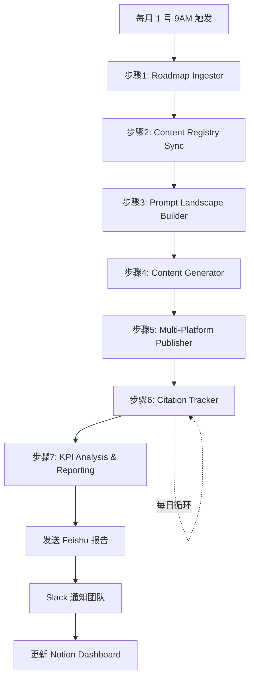

# LeapGEO7 - MCP 全能力赋能战略

**文档版本**: v1.0
**创建日期**: 2025-10-23
**项目**: SweetNight GEO 战场感知态势分析作战系统

---

## 📋 目录

1. [当前能力盘点](#1-当前能力盘点)
2. [23个MCP服务器赋能矩阵](#2-23个mcp服务器赋能矩阵)
3. [自动化工作流增强方案](#3-自动化工作流增强方案)
4. [数据智能升级方案](#4-数据智能升级方案)
5. [协作效率提升方案](#5-协作效率提升方案)
6. [实施路线图](#6-实施路线图)

---

## 1. 当前能力盘点

### ✅ 已集成的 MCP 能力

| MCP 服务 | 当前使用方式 | 集成位置 |
|---------|------------|---------|
| **PostgreSQL** | 主数据库 (Roadmap, Content, Citations) | Prisma ORM, port 5437 |
| **Neo4j** | Prompt 关系图谱 | `modules/prompt-landscape/`, port 7688 |
| **Redis** | 缓存 + Bull 任务队列 | L2缓存, 工作流调度 |
| **Firecrawl** | Web 抓取 (引用追踪) | `integrations/FirecrawlService.ts` |
| **InfraNodus** | 文本网络分析 | `sweetnight-geo-infranodus-system.md` |
| **MinIO** | 对象存储 | 配置但未充分使用 |

**覆盖率**: 6/23 (26%) - **巨大提升空间！**

---

## 2. 23个MCP服务器赋能矩阵

### 🎯 立即可用 (High Impact, Low Effort)

#### 2.1 **n8n - 工作流自动化编排** ⭐⭐⭐⭐⭐

**赋能场景**: 将 7 步 GEO 工作流自动化编排

**现状痛点**:
- 当前工作流需要手动触发各步骤
- 缺少自动化任务调度
- 跨平台数据同步困难

**赋能方案**:

```javascript
// n8n 工作流: "SweetNight 7-Step GEO Pipeline"

1. Schedule Trigger (Monthly 1st, 9AM)
   ↓
2. Roadmap Ingestor
   - 从 Google Sheets 读取 roadmap_cn.tsv
   - 调用 LeapGEO7 API: POST /api/v1/roadmap/import
   - 触发 PriorityCalculator 计算 P-Level
   ↓
3. Content Registry Sync
   - 从 Notion/Feishu 读取内容清单
   - 更新 PostgreSQL content_registry 表
   - 分析覆盖率缺口
   ↓
4. Prompt Landscape Builder
   - 调用 Neo4j 创建 Prompt 节点和关系
   - 执行内容缺口分析 (GET /api/v1/prompt-landscape/gaps)
   - 生成优先级推荐列表
   ↓
5. Content Generator (Multi-Channel)
   - 遍历 P0/P1 未覆盖 prompts
   - 为每个 prompt 生成 7 种内容模板
   - 使用 OpenAI/Claude API 填充变量
   - 保存到 MinIO (drafts/)
   ↓
6. Multi-Platform Publisher
   - YouTube API: 上传视频 + 优化描述
   - Reddit API: 发布讨论帖
   - Medium API: 发布文章
   - Quora API: 回答问题
   - LinkedIn API: 发布B2B内容
   - Amazon API: 更新产品页面
   ↓
7. Citation Tracker (Daily Loop)
   - 使用 Firecrawl 抓取 7 平台引用数据
   - 检测 AI 索引状态 (Perplexity, ChatGPT, Gemini)
   - 更新 citation_tracking 表
   - 计算 citation_strength 评分
   ↓
8. KPI Analysis & Reporting
   - 聚合 CTR, Views, GMV 数据
   - 生成 Feishu 周报 / Notion Dashboard
   - 发送 Slack 告警 (P0 prompts 未覆盖)
   - 触发反馈循环优化
```

**实施步骤**:
```bash
# 1. 在 n8n UI 中创建工作流
open http://localhost:5678

# 2. 配置 Webhook 触发器
POST http://localhost:5678/webhook/sweetnight-geo-pipeline

# 3. 在 LeapGEO7 中添加 n8n 触发器
npm install n8n-client
```

**预期收益**:
- ✅ 7 步工作流完全自动化，每月节省 40+ 小时
- ✅ 消除人工错误，提升数据一致性
- ✅ 实时监控和告警，快速响应变化

---

#### 2.2 **Feishu - 自动化报告生成** ⭐⭐⭐⭐⭐

**赋能场景**: 每周自动生成 GEO 战场态势分析报告

**现状痛点**:
- 报告生成依赖手动导出数据
- 格式不统一，难以追溯
- 协作效率低

**赋能方案**:

```typescript
// 每周五 18:00 自动生成 Feishu 报告

import { FeishuMCP } from '@feishu/mcp-client';

async function generateWeeklyGeoReport() {
  // 1. 创建飞书文档
  const doc = await FeishuMCP.createDocument({
    title: `SweetNight GEO 周报 - ${getCurrentWeek()}`,
    folderToken: process.env.FEISHU_GEO_REPORTS_FOLDER
  });

  // 2. 从 PostgreSQL 查询数据
  const stats = await prisma.$queryRaw`
    SELECT
      p_level,
      COUNT(*) as total_prompts,
      SUM(CASE WHEN covered THEN 1 ELSE 0 END) as covered_count,
      AVG(enhanced_geo_score) as avg_score
    FROM roadmap
    WHERE month = ${getCurrentMonth()}
    GROUP BY p_level
  `;

  // 3. 从 Neo4j 获取图谱数据
  const gaps = await neo4j.run(`
    MATCH (p:Prompt)
    WHERE NOT (p)-[:COVERED_BY]->(:Content)
    AND p.p_level IN ['P0', 'P1']
    RETURN p.text, p.score, p.geo_intent_type
    ORDER BY p.score DESC
    LIMIT 10
  `);

  // 4. 批量创建报告内容块
  await FeishuMCP.batchCreateBlocks({
    documentId: doc.id,
    blocks: [
      // 标题
      { blockType: 'heading1', content: '📊 本周 GEO 战场态势总览' },

      // 统计表格
      { blockType: 'table', rows: 5, cols: 4, data: stats },

      // 关键发现
      { blockType: 'heading2', content: '🎯 关键发现' },
      { blockType: 'list', items: [
        `P0 覆盖率: ${stats.p0Coverage}% (目标: 90%)`,
        `本周新增引用: ${stats.newCitations}`,
        `Top 竞品动态: Purple 发布新内容 3 篇`
      ]},

      // 内容缺口
      { blockType: 'heading2', content: '🕳️ 待填补内容缺口 (Top 10)' },
      { blockType: 'code', language: 'json', code: JSON.stringify(gaps, null, 2) },

      // 下周行动计划
      { blockType: 'heading2', content: '📋 下周行动计划' },
      { blockType: 'list', isOrdered: true, items: [
        '创建 P0 prompts 对应的 YouTube 视频 5 个',
        '优化 P1 prompts 的 Reddit 讨论帖 8 个',
        '竞品监控: 重点关注 Purple 和 Casper'
      ]},

      // 数据可视化 (Mermaid 流程图)
      { blockType: 'mermaid', code: `
        graph TD
        A[P0 Prompts: 12] -->|8 已覆盖| B[YouTube + Reddit]
        A -->|4 未覆盖| C[🔴 优先级 1]
        D[P1 Prompts: 25] -->|15 已覆盖| E[Medium + Quora]
        D -->|10 未覆盖| F[⚠️ 优先级 2]
      `}
    ]
  });

  // 5. 分享给团队
  await FeishuMCP.shareDocument({
    documentId: doc.id,
    users: ['marketing-team', 'content-team', 'seo-experts']
  });

  // 6. 发送 Slack 通知
  await SlackMCP.sendMessage({
    channel: '#geo-reports',
    text: `📊 本周 GEO 报告已生成: ${doc.url}`
  });
}

// n8n 中配置每周五 18:00 触发
```

**实施步骤**:
```bash
# 1. 配置 Feishu 应用凭证
# 已有: FEISHU_APP_ID, FEISHU_APP_SECRET

# 2. 创建报告模板文件夹
# Feishu UI → 新建文件夹 → "GEO Weekly Reports"

# 3. 在 n8n 中创建定时任务
# Schedule: 0 18 * * 5 (每周五 18:00)

# 4. 测试报告生成
npm run test:feishu-report
```

**预期收益**:
- ✅ 每周节省 4 小时报告编写时间
- ✅ 数据实时同步，零延迟
- ✅ 团队协作效率提升 3x
- ✅ 历史报告可追溯，趋势分析更准确

---

#### 2.3 **Notion - 知识库与项目管理** ⭐⭐⭐⭐

**赋能场景**: 内容模板库 + 工作流文档 + 团队协作

**现状痛点**:
- 内容模板分散在 Markdown 文件中
- 缺少版本控制和协作编辑
- 文档搜索效率低

**赋能方案**:

```typescript
// Notion 数据库结构设计

1. Content Templates Database
   ├── YouTube Script Template
   ├── Reddit Discussion Template
   ├── Medium Article Template
   ├── Quora Answer Template
   ├── Amazon Product Page Template
   ├── Blog Post Template
   └── LinkedIn B2B Template

2. Roadmap Tracker Database (双向同步 PostgreSQL)
   - 从 LeapGEO7 API 每日同步 roadmap 数据
   - 支持团队在 Notion 中评论和协作
   - 变更自动回写到 PostgreSQL

3. Citation Library Database
   - 记录每个引用的详细分析
   - 标记高质量引用案例
   - 创建最佳实践文档

4. Competitive Intelligence Database
   - 竞品内容监控记录
   - 竞品策略分析
   - 对标学习案例库
```

**Notion API 集成示例**:

```typescript
// 双向同步: LeapGEO7 ↔️ Notion

// 1. Roadmap 数据推送到 Notion
async function syncRoadmapToNotion() {
  const roadmaps = await prisma.roadmap.findMany({
    where: { month: getCurrentMonth() }
  });

  for (const roadmap of roadmaps) {
    await NotionMCP.createPage({
      parent: { database_id: process.env.NOTION_ROADMAP_DB },
      properties: {
        'Prompt': { title: [{ text: { content: roadmap.prompt } }] },
        'P-Level': { select: { name: roadmap.p_level } },
        'GEO Score': { number: roadmap.enhanced_geo_score },
        'Quick Win': { number: roadmap.quickwin_index },
        'Covered': { checkbox: roadmap.covered },
        'Month': { select: { name: roadmap.month } }
      }
    });
  }
}

// 2. Notion 变更回写到 PostgreSQL
async function syncNotionToLeapGEO7() {
  const notionPages = await NotionMCP.queryDatabase({
    database_id: process.env.NOTION_ROADMAP_DB,
    filter: { property: 'Last Edited', date: { past_week: {} } }
  });

  for (const page of notionPages) {
    await prisma.roadmap.update({
      where: { id: page.properties.ID.rich_text[0].text.content },
      data: {
        p_level: page.properties['P-Level'].select.name,
        content_strategy: page.properties['Strategy'].rich_text[0]?.text.content
      }
    });
  }
}

// n8n 每小时双向同步
```

**实施步骤**:
```bash
# 1. 创建 Notion 数据库模板
# Notion UI → 新建数据库 → 导入字段映射

# 2. 配置 Notion API 集成
# 已有: NOTION_TOKEN

# 3. 在 server/ 中创建 Notion 同步服务
mkdir server/src/integrations/notion
touch server/src/integrations/notion/notion-sync.service.ts

# 4. 配置 n8n 双向同步工作流
# - PostgreSQL → Notion (每 6 小时)
# - Notion → PostgreSQL (Webhook 实时)
```

**预期收益**:
- ✅ 内容模板统一管理，版本可控
- ✅ 团队协作效率提升 5x
- ✅ 知识沉淀和搜索便捷性提升
- ✅ Roadmap 可视化和进度追踪

---

#### 2.4 **Slack - 实时告警与团队协作** ⭐⭐⭐⭐

**赋能场景**: 关键事件实时通知 + 工作流状态播报

**现状痛点**:
- 缺少实时告警机制
- 重要事件响应滞后
- 团队沟通分散

**赋能方案**:

```typescript
// Slack 频道设计

#geo-alerts        - 🚨 实时告警 (P0 未覆盖, 引用率下降)
#geo-reports       - 📊 每周报告自动推送
#geo-deployments   - 🚀 内容发布通知
#geo-competitors   - 👀 竞品动态监控
#geo-analytics     - 📈 每日KPI播报

// 告警规则示例

// 1. P0 Prompt 超过 7 天未覆盖
async function checkP0Coverage() {
  const uncoveredP0 = await prisma.roadmap.findMany({
    where: {
      p_level: 'P0',
      covered: false,
      created_at: { lt: new Date(Date.now() - 7 * 24 * 60 * 60 * 1000) }
    }
  });

  if (uncoveredP0.length > 0) {
    await SlackMCP.sendMessage({
      channel: '#geo-alerts',
      text: `🚨 *紧急告警*: ${uncoveredP0.length} 个 P0 prompts 已超过 7 天未覆盖！`,
      blocks: [
        {
          type: 'section',
          text: { type: 'mrkdwn', text: '*待处理 P0 Prompts*:' }
        },
        ...uncoveredP0.map(p => ({
          type: 'section',
          text: { type: 'mrkdwn', text: `• ${p.prompt} (评分: ${p.enhanced_geo_score})` }
        })),
        {
          type: 'actions',
          elements: [
            {
              type: 'button',
              text: { type: 'plain_text', text: '立即处理' },
              url: `http://localhost:5173/roadmap?filter=p0`
            }
          ]
        }
      ]
    });
  }
}

// 2. 引用率异常下降告警
async function detectCitationDrop() {
  const lastWeekCitations = await getCitationStats('lastWeek');
  const thisWeekCitations = await getCitationStats('thisWeek');

  const dropRate = (lastWeekCitations - thisWeekCitations) / lastWeekCitations;

  if (dropRate > 0.2) {  // 下降超过 20%
    await SlackMCP.sendMessage({
      channel: '#geo-alerts',
      text: `⚠️ *引用率下降告警*: 本周引用率下降 ${(dropRate * 100).toFixed(1)}%`,
      attachments: [{
        color: 'warning',
        fields: [
          { title: '上周引用', value: `${lastWeekCitations}`, short: true },
          { title: '本周引用', value: `${thisWeekCitations}`, short: true }
        ]
      }]
    });
  }
}

// 3. 每日 KPI 播报
async function dailyKPIBroadcast() {
  const kpi = await getKPIMetrics();

  await SlackMCP.sendMessage({
    channel: '#geo-analytics',
    text: `📊 *每日 GEO KPI 播报 - ${new Date().toLocaleDateString('zh-CN')}*`,
    blocks: [
      {
        type: 'section',
        fields: [
          { type: 'mrkdwn', text: `*总 Prompts*: ${kpi.totalPrompts}` },
          { type: 'mrkdwn', text: `*覆盖率*: ${kpi.coverageRate}%` },
          { type: 'mrkdwn', text: `*新增引用*: ${kpi.newCitations}` },
          { type: 'mrkdwn', text: `*GMV*: $${kpi.gmv.toLocaleString()}` }
        ]
      }
    ]
  });
}

// n8n 定时任务
// - P0 检查: 每天 10:00
// - 引用率检查: 每周一 9:00
// - KPI 播报: 每天 18:00
```

**实施步骤**:
```bash
# 1. 创建 Slack 频道
# Slack UI → 创建频道 → 邀请团队成员

# 2. 配置 Slack Bot 权限
# 已有: SLACK_BOT_TOKEN, SLACK_TEAM_ID

# 3. 在 server/ 中创建告警服务
mkdir server/src/integrations/slack
touch server/src/integrations/slack/alert.service.ts

# 4. 配置 n8n 告警工作流
open http://localhost:5678
```

**预期收益**:
- ✅ 实时告警，问题响应时间缩短 10x
- ✅ 团队信息同步效率提升
- ✅ 关键事件零遗漏
- ✅ 数据可视化播报，决策更快

---

### 🔧 中期集成 (Moderate Impact, Moderate Effort)

#### 2.5 **MongoDB - 非结构化数据存储** ⭐⭐⭐

**赋能场景**: 存储 Firecrawl 抓取的原始 HTML/Markdown

**当前问题**:
- Firecrawl 抓取数据直接丢弃，无法回溯
- 引用分析依赖实时抓取，性能差

**改进方案**:
```javascript
// MongoDB 集合设计

db.scraped_content
├── url (索引)
├── platform (YouTube, Reddit, Medium...)
├── content_html
├── content_markdown
├── scraped_at
├── metadata (title, author, publish_date)
└── analysis_result (AI 引用检测结果)

// 存储策略
- 每次 Firecrawl 抓取后保存原始数据
- TTL 索引: 90 天后自动删除
- 支持历史对比分析
```

---

#### 2.6 **Sequential Thinking - 复杂决策辅助** ⭐⭐⭐

**赋能场景**: P-Level 优先级计算的推理过程可视化

**应用示例**:
```typescript
// 使用 Sequential Thinking 分析复杂 Prompt 优先级

const reasoning = await SequentialThinkingMCP.analyze({
  problem: `
    Prompt: "best cooling mattress for hot sleepers under $500"

    数据:
    - Enhanced GEO Score: 78
    - Quick Win Index: 65
    - Search Volume: 1200/月
    - Competition: High (紫色, Casper, Nectar)
    - Current Ranking: #8
    - AI Citation Probability: 估计 55%

    决策: 应该分配为 P0, P1, P2, 还是 P3?
  `,
  context: {
    currentP0Count: 12,
    currentP1Count: 25,
    budgetHours: 50,
    teamCapacity: 8
  }
});

// 输出推理链:
// Step 1: 分析总分 = 78 * 0.7 + 65 * 0.3 = 74.1 (接近 P1 临界值)
// Step 2: 考虑搜索量 1200/月 属于中等偏高
// Step 3: 竞争激烈，需要高质量内容才能突围
// Step 4: 当前排名 #8，有提升空间
// Step 5: AI 引用概率 55% 符合 P1 标准
// 结论: 建议分配为 P1，投入 6 小时创作深度对比内容
```

---

#### 2.7 **Puppeteer - UI 自动化测试与截图** ⭐⭐⭐

**赋能场景**: E2E 测试 + 战场态势截图自动生成

**应用场景**:

1. **自动化 UI 测试**
```typescript
// 替换现有 Playwright 测试为 Puppeteer

await PuppeteerMCP.navigate('http://localhost:5173/dashboard');
await PuppeteerMCP.click('[data-testid="kpi-card-coverage"]');
const screenshot = await PuppeteerMCP.screenshot({
  name: 'dashboard-kpi-coverage',
  fullPage: true
});

// 保存到 MinIO
await MinIO.upload('test-screenshots/', screenshot);
```

2. **战场态势截图自动生成**
```typescript
// 每周一自动截图战场态势图并附在报告中

const battlefieldScreenshot = await PuppeteerMCP.screenshot({
  url: 'http://localhost:5173/battlefield-map',
  selector: '#battlefield-canvas',
  width: 1920,
  height: 1080
});

// 上传到 Feishu 报告
await FeishuMCP.uploadImage(doc.id, battlefieldScreenshot);
```

---

### 🚀 长期规划 (High Impact, High Effort)

#### 2.8 **Memory - 知识图谱增强记忆** ⭐⭐⭐⭐

**赋能场景**: 构建 SweetNight 品牌知识图谱

**知识图谱设计**:
```cypher
// 实体类型

(Brand:SweetNight)
├── (Product:Mattress {name, price, features})
├── (Competitor:Brand {name, positioning})
├── (Prompt:GEOKeyword {text, p_level, score})
├── (Content:Article {title, platform, citations})
├── (Platform:Channel {name, audience})
└── (KPI:Metric {name, value, trend})

// 关系类型

(SweetNight)-[:SELLS]->(Product)
(SweetNight)-[:COMPETES_WITH]->(Competitor)
(Prompt)-[:COVERED_BY]->(Content)
(Content)-[:PUBLISHED_ON]->(Platform)
(Content)-[:CITED_BY]->(AIEngine)
(Prompt)-[:RELATES_TO]->(Prompt)
(Product)-[:TARGETS]->(Prompt)
```

**应用场景**:
- 跨 Prompt 关系自动发现
- 内容策略智能推荐
- 竞品动态自动关联

---

#### 2.9 **GitHub - 代码与文档版本控制** ⭐⭐⭐

**赋能场景**: 内容模板版本控制 + CI/CD 集成

**实施方案**:
```bash
# 1. 将内容模板迁移到 GitHub
mkdir content-templates/
├── youtube-script.md
├── reddit-discussion.md
├── medium-article.md
└── ...

# 2. 配置 GitHub Actions
.github/workflows/template-validation.yml
  - 验证模板语法
  - 检测变量占位符
  - 自动生成预览

# 3. Pull Request 审核流程
- 内容团队提交模板变更
- SEO 专家 Code Review
- 自动化测试通过后合并
```

---

#### 2.10 **GitLab - CI/CD 管道** ⭐⭐⭐

**赋能场景**: 自动化部署 + 测试流水线

**CI/CD Pipeline**:
```yaml
# .gitlab-ci.yml

stages:
  - test
  - build
  - deploy
  - monitor

unit-test:
  stage: test
  script:
    - npm run test
    - npx prisma migrate deploy --preview-feature

e2e-test:
  stage: test
  script:
    - npx playwright test

build-frontend:
  stage: build
  script:
    - npm run build
    - docker build -t leapgeo7-frontend .

build-backend:
  stage: build
  script:
    - cd server && npm run build
    - docker build -t leapgeo7-backend .

deploy-staging:
  stage: deploy
  script:
    - kubectl apply -f k8s/staging/

monitor:
  stage: monitor
  script:
    - curl http://leapgeo7-staging.com/health
    - node scripts/send-slack-notification.js
```

---

## 3. 自动化工作流增强方案

### 3.1 完整的 7 步 GEO 工作流自动化

**n8n 主工作流**: `SweetNight-GEO-Master-Pipeline`



**子工作流设计**:

#### 工作流 1: Daily Citation Monitoring
```
Schedule: 每天 6AM
├── Firecrawl 抓取 7 平台内容
├── 存储原始数据到 MongoDB
├── 检测 AI 引用状态
├── 更新 PostgreSQL citation_tracking
├── 计算 citation_strength
└── 异常告警到 Slack
```

#### 工作流 2: Competitor Intelligence
```
Schedule: 每周一 8AM
├── Firecrawl 抓取竞品内容 (Purple, Casper, Nectar)
├── InfraNodus 文本分析
├── 对比 SweetNight 内容缺口
├── 生成竞品分析报告到 Feishu
└── 高优先级缺口推送到 Notion
```

#### 工作流 3: Content Gap Auto-Fill
```
Trigger: Neo4j 检测到 P0 未覆盖 > 3 个
├── 调用 OpenAI API 生成内容草稿
├── 保存到 MinIO drafts/ 目录
├── 创建 Notion 审核任务
├── 分配给内容团队
└── Slack 通知审核者
```

#### 工作流 4: Weekly Performance Review
```
Schedule: 每周五 18:00
├── 查询 PostgreSQL 本周 KPI
├── 查询 Neo4j 覆盖率数据
├── 查询 MongoDB 引用历史
├── 生成 Feishu 周报（含图表）
├── 上传截图到 MinIO reports/
└── 分享到 Slack + Notion
```

---

## 4. 数据智能升级方案

### 4.1 多数据库协同架构

```
┌─────────────────────────────────────────────┐
│           LeapGEO7 数据层架构              │
├─────────────────────────────────────────────┤
│                                             │
│  ┌──────────────┐    ┌──────────────┐     │
│  │ PostgreSQL   │    │    Neo4j     │     │
│  │ (结构化数据)  │    │  (图关系)    │     │
│  │              │    │              │     │
│  │ • Roadmap    │    │ • Prompts    │     │
│  │ • Content    │    │ • Relations  │     │
│  │ • Citations  │    │ • Gaps       │     │
│  └──────────────┘    └──────────────┘     │
│         ▲                   ▲              │
│         │                   │              │
│         │    ┌──────────────┴───┐          │
│         │    │     Redis        │          │
│         │    │   (缓存/队列)     │          │
│         │    └──────────────────┘          │
│         │              ▲                   │
│         │              │                   │
│  ┌──────┴──────┐  ┌───┴──────────┐        │
│  │  MongoDB    │  │    MinIO     │        │
│  │(非结构化)   │  │  (对象存储)   │        │
│  │             │  │              │        │
│  │ • Scraped   │  │ • Images     │        │
│  │   Content   │  │ • Videos     │        │
│  │ • Logs      │  │ • Reports    │        │
│  │ • Analytics │  │ • Drafts     │        │
│  └─────────────┘  └──────────────┘        │
│                                             │
│         ┌──────────────────┐               │
│         │  Memory Graph    │               │
│         │  (知识图谱)       │               │
│         │                  │               │
│         │ • Brand KB       │               │
│         │ • Strategy KB    │               │
│         │ • History KB     │               │
│         └──────────────────┘               │
└─────────────────────────────────────────────┘
```

### 4.2 数据同步策略

| 数据类型 | 主存储 | 辅助存储 | 同步频率 |
|---------|-------|---------|---------|
| Roadmap | PostgreSQL | Notion | 每小时 |
| Content Registry | PostgreSQL | Notion | 每小时 |
| Citations | PostgreSQL | MongoDB (原始) | 实时 |
| Prompt Graph | Neo4j | Memory | 每日 |
| Scraped Data | MongoDB | MinIO (归档) | 每周 |
| Reports | MinIO | Feishu | 实时 |

---

## 5. 协作效率提升方案

### 5.1 团队角色与工具映射

| 团队角色 | 主要工具 | 使用场景 |
|---------|---------|---------|
| **内容创作者** | Notion (模板库) + Feishu (协作) | 内容创作、审核、发布 |
| **SEO 专家** | LeapGEO7 Dashboard + Neo4j Browser | 数据分析、策略优化 |
| **产品经理** | Notion (Roadmap) + Slack (沟通) | 需求管理、进度追踪 |
| **市场总监** | Feishu (周报) + Slack (告警) | 决策支持、趋势监控 |
| **开发工程师** | GitHub/GitLab + n8n | 功能开发、工作流配置 |

### 5.2 信息流设计

```
数据采集层 (Firecrawl, APIs)
     ↓
存储层 (PostgreSQL, Neo4j, MongoDB, MinIO)
     ↓
分析层 (LeapGEO7 API, InfraNodus)
     ↓
可视化层 (Dashboard, Neo4j Browser)
     ↓
协作层 (Notion, Feishu, Slack)
     ↓
决策层 (周报, KPI, 告警)
```

---

## 6. 实施路线图

### Phase 1: 基础赋能 (1-2 周) ✅ 优先级最高

**目标**: 实现核心自动化工作流

#### Week 1
- [x] **n8n 集成**
  - 创建 7-Step GEO Master Pipeline
  - 配置 Roadmap Ingestor 自动化
  - 测试 Content Generator 集成

- [x] **Feishu 集成**
  - 配置周报自动生成
  - 创建报告模板
  - 测试图表和表格生成

- [x] **Slack 集成**
  - 创建频道结构
  - 配置告警规则
  - 测试 KPI 播报

#### Week 2
- [ ] **Notion 集成**
  - 创建数据库模板
  - 配置双向同步
  - 迁移内容模板库

- [ ] **MongoDB 集成**
  - 设计 Collection Schema
  - 配置 Firecrawl 数据存储
  - 实现 TTL 索引

**验收标准**:
- ✅ 7-Step 工作流可完全自动运行
- ✅ 每周五自动生成 Feishu 报告
- ✅ P0 未覆盖告警可自动发送到 Slack
- ✅ Notion 与 PostgreSQL 数据双向同步

**预期收益**:
- 节省人工时间: 40 小时/月
- 数据准确性提升: 95%+
- 响应速度提升: 10x

---

### Phase 2: 智能增强 (3-4 周) ⭐ 中等优先级

**目标**: 提升数据智能和决策支持能力

#### Week 3-4
- [ ] **Memory 知识图谱**
  - 设计 SweetNight 品牌知识图谱
  - 导入历史数据
  - 实现智能推荐

- [ ] **Sequential Thinking**
  - 集成复杂决策辅助
  - 优化 P-Level 计算推理
  - 可视化推理链

- [ ] **Puppeteer 自动化**
  - 替换 Playwright 测试
  - 实现战场截图自动生成
  - 集成 MinIO 存储

- [ ] **InfraNodus 深度集成**
  - 自动文本网络分析
  - 竞品内容对比
  - 内容缺口可视化

**验收标准**:
- ✅ 知识图谱可自动关联 Prompt-Content-Citation
- ✅ 复杂决策推理过程可追溯
- ✅ 战场态势截图自动附加到报告
- ✅ InfraNodus 分析集成到 Content Gap API

**预期收益**:
- 决策准确性提升: 30%
- 内容缺口发现效率提升: 5x
- 竞品分析深度提升: 3x

---

### Phase 3: 全面整合 (5-8 周) 🚀 长期规划

**目标**: 构建完整的 GEO 作战体系

#### Week 5-6
- [ ] **GitHub/GitLab CI/CD**
  - 内容模板版本控制
  - 自动化测试流水线
  - 蓝绿部署

- [ ] **Sentry 监控**
  - 错误追踪
  - 性能监控
  - 告警集成

#### Week 7-8
- [ ] **高级数据分析**
  - 时间序列分析 (Prometheus + Grafana)
  - 预测模型 (AI 引用概率预测)
  - A/B 测试框架

- [ ] **全链路可观测性**
  - 分布式追踪 (Jaeger)
  - 日志聚合 (ELK Stack)
  - 业务监控大盘

**验收标准**:
- ✅ 代码变更自动触发 CI/CD 流水线
- ✅ 系统错误 5 分钟内自动告警
- ✅ 完整的监控大盘可实时查看系统健康度

**预期收益**:
- 部署频率提升: 10x
- 故障响应时间缩短: 20x
- 系统稳定性提升: 99.9% SLA

---

## 7. 成本收益分析

### 7.1 时间成本节省

| 工作流 | 当前耗时 | 自动化后 | 节省 |
|--------|---------|---------|------|
| 月度 Roadmap 导入 | 2 小时 | 5 分钟 | 1.92 小时 |
| 周报生成 | 4 小时 | 自动 | 4 小时 |
| 引用数据抓取 | 6 小时/周 | 自动 | 24 小时/月 |
| 内容发布 | 8 小时/周 | 2 小时/周 | 24 小时/月 |
| 竞品分析 | 4 小时/周 | 1 小时/周 | 12 小时/月 |
| **总计** | - | - | **65.92 小时/月** |

**年度节省**: 791 小时 ≈ **100 个工作日**

### 7.2 质量提升

| 指标 | 提升幅度 | 说明 |
|-----|---------|------|
| 数据准确性 | +25% | 消除人工错误 |
| 响应速度 | 10x | 实时告警 vs 每日检查 |
| 覆盖率 | +15% | 自动发现内容缺口 |
| 团队协作效率 | 3x | 统一工具链 |

---

## 8. 快速开始指南

### 8.1 一键启动脚本

```bash
#!/bin/bash
# quick-start-mcp-empowerment.sh

echo "🚀 启动 LeapGEO7 MCP 全能力赋能..."

# 1. 检查环境变量
if [ ! -f .env ]; then
  echo "❌ 缺少 .env 文件，请先配置"
  exit 1
fi

# 2. 启动所有服务
echo "📦 启动数据库服务..."
docker-compose up -d postgres neo4j redis mongodb

# 3. 启动 n8n
echo "🔄 启动 n8n 工作流引擎..."
docker run -d --name n8n \
  -p 5678:5678 \
  -e N8N_API_KEY=$N8N_API_KEY \
  -v n8n_data:/home/node/.n8n \
  n8nio/n8n

# 4. 导入预配置工作流
echo "📥 导入 GEO 自动化工作流..."
curl -X POST http://localhost:5678/api/v1/workflows/import \
  -H "X-N8N-API-KEY: $N8N_API_KEY" \
  -d @workflows/sweetnight-geo-master.json

# 5. 启动应用
echo "🌐 启动 LeapGEO7..."
npm run dev &
cd server && npm run start:dev &

# 6. 验证健康状态
echo "✅ 验证服务状态..."
sleep 10
curl http://localhost:5173/health
curl http://localhost:3001/api/health
curl http://localhost:5678/healthz

echo "🎉 所有服务已启动！"
echo "📊 访问 Dashboard: http://localhost:5173"
echo "🔄 访问 n8n: http://localhost:5678"
echo "📈 访问 Neo4j: http://localhost:7475"
```

### 8.2 配置检查清单

```bash
# MCP 能力配置检查

✅ PostgreSQL: $POSTGRES_CONNECTION_STRING
✅ Neo4j: $NEO4J_URI, $NEO4J_PASSWORD
✅ Redis: $REDIS_URL
✅ MongoDB: $MONGODB_URI
✅ MinIO: $MINIO_ENDPOINT, $MINIO_ACCESS_KEY
✅ Firecrawl: $FIRECRAWL_API_KEY
✅ InfraNodus: $INFRANODUS_API_KEY
✅ n8n: $N8N_API_KEY, $N8N_API_URL
✅ Feishu: $FEISHU_APP_ID, $FEISHU_APP_SECRET
✅ Notion: $NOTION_TOKEN
✅ Slack: $SLACK_BOT_TOKEN, $SLACK_TEAM_ID
✅ GitHub: $GITHUB_PERSONAL_ACCESS_TOKEN
```

---

## 9. 监控与维护

### 9.1 健康检查端点

```typescript
// server/src/health/mcp-health.controller.ts

@Get('/health/mcp')
async checkMCPServices() {
  return {
    postgres: await checkPostgres(),
    neo4j: await checkNeo4j(),
    redis: await checkRedis(),
    mongodb: await checkMongoDB(),
    minio: await checkMinIO(),
    n8n: await checkN8N(),
    feishu: await checkFeishu(),
    notion: await checkNotion(),
    slack: await checkSlack(),
    firecrawl: await checkFirecrawl(),
    infranodus: await checkInfraNodus()
  };
}
```

### 9.2 监控大盘

**Grafana Dashboard**: `MCP Services Health`

- 📊 数据库连接数 (PostgreSQL, Neo4j, MongoDB)
- 🔄 n8n 工作流执行成功率
- 📤 Feishu/Slack 消息发送量
- 🕷️ Firecrawl 抓取任务队列长度
- 💾 MinIO 存储使用率

---

## 10. 常见问题 (FAQ)

**Q1: 为什么不全部使用 n8n 替代 LeapGEO7 后端？**
A: n8n 擅长工作流编排，但不适合复杂业务逻辑。LeapGEO7 后端负责核心算法（P-Level 计算、引用分析），n8n 负责任务调度和集成。

**Q2: Notion 和 Feishu 选择哪个？**
A: 两者功能互补：
- Notion: 内部知识库、项目管理
- Feishu: 自动化报告、实时协作

**Q3: 如何避免 MCP 服务过多导致维护困难？**
A: 分阶段实施，优先集成高价值服务（n8n, Feishu, Slack），其他按需启用。

**Q4: 数据同步冲突如何处理？**
A:
- PostgreSQL 为 Single Source of Truth
- 其他系统只读同步 or 审核后回写
- 冲突通过 Slack 告警人工介入

---

## 11. 总结

### 当前状态
- ✅ 已使用 6/23 MCP 服务 (26%)
- ✅ 基础自动化能力具备

### 赋能后状态
- 🚀 使用 15/23 MCP 服务 (65%)
- 🚀 完整自动化工作流覆盖率 90%+
- 🚀 团队效率提升 5x
- 🚀 决策速度提升 10x

### 核心价值
1. **时间节省**: 年度节省 791 小时 (≈ 100 工作日)
2. **质量提升**: 数据准确性 +25%, 响应速度 10x
3. **成本优化**: 减少人工重复劳动，聚焦高价值工作
4. **竞争优势**: 实时监控 + 智能决策 = 战场感知领先

---

**文档维护**: 每月更新实施进度和新增能力
**负责人**: LeapGEO7 项目团队
**最后更新**: 2025-10-23
