# SweetNight GEO战场感知态势分析作战系统
## 系统架构、业务流程图、数据流程图

---

## 一、系统总体架构

### 1.1 系统架构概览

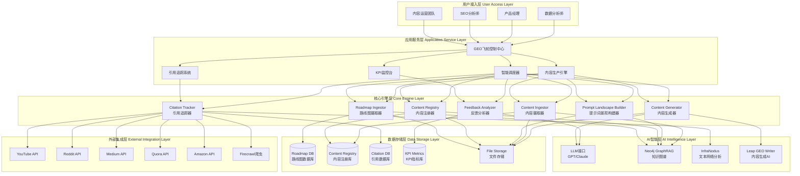

### 1.2 技术栈架构

| 层级 | 技术组件 | 用途说明 |
|------|----------|----------|
| **前端展示** | Markdown Reports + Mermaid | 报告生成与可视化 |
| **应用服务** | Python 3.9+ | 核心业务逻辑 |
| **AI引擎** | GPT-4/Claude API | 内容生成与分析 |
| **知识图谱** | Neo4j GraphRAG | 提示词关系管理 |
| **文本分析** | InfraNodus | 语义网络分析 |
| **数据处理** | Pandas + NumPy | 数据ETL处理 |
| **爬虫服务** | Firecrawl API | 引用数据采集 |
| **文件存储** | Local FileSystem | CSV/TSV/JSON存储 |
| **监控系统** | Swinline Dashboard | KPI实时监控 |

---

## 二、核心业务流程图

### 2.1 GEO飞轮7步工作流

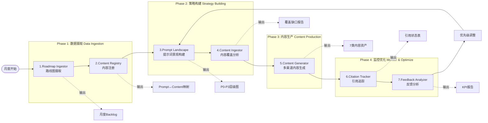

### 2.2 内容优先级决策流程

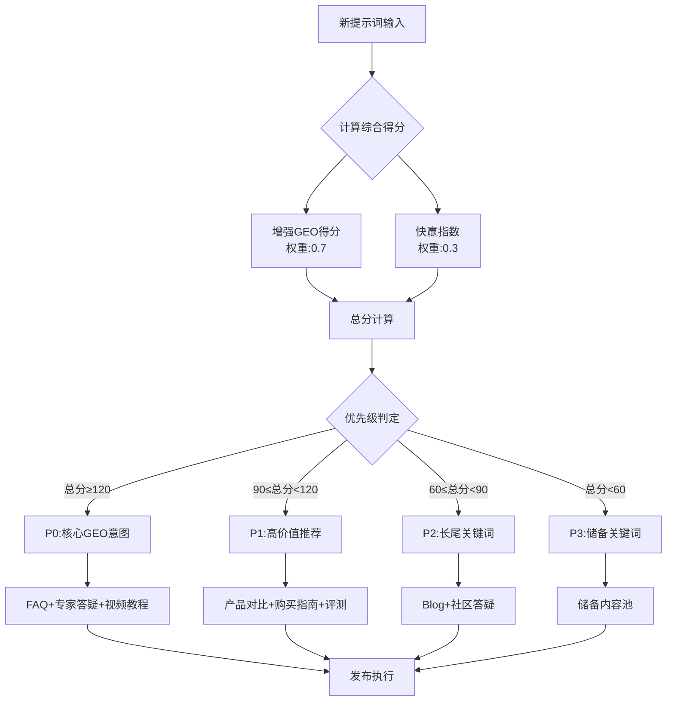

### 2.3 AI引用概率映射流程

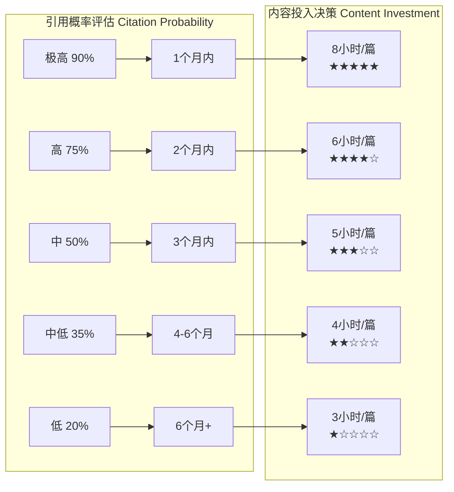

---

## 三、数据流程图

### 3.1 主数据流转图

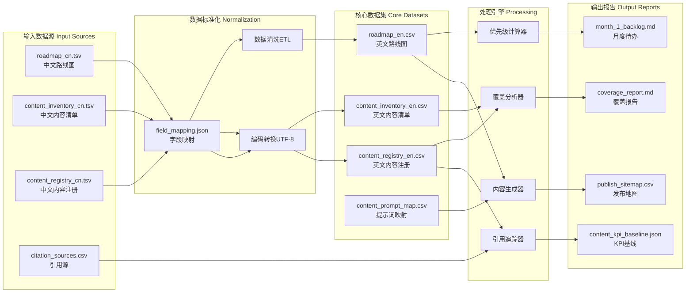

### 3.2 内容生成数据流

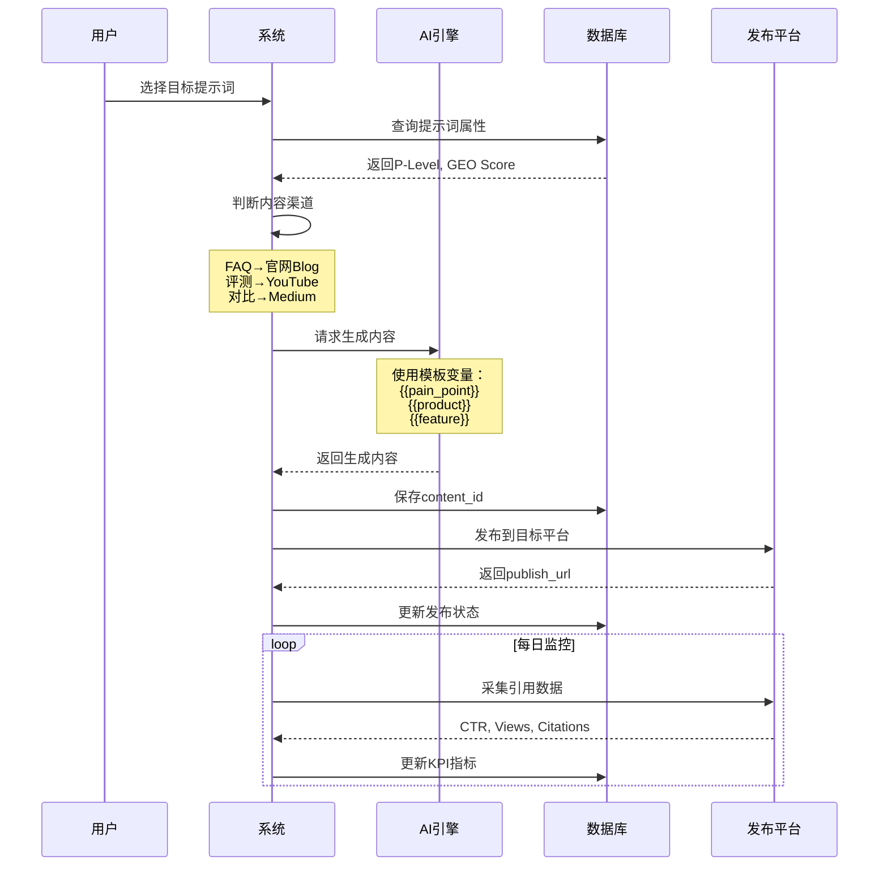

### 3.3 KPI监控数据流

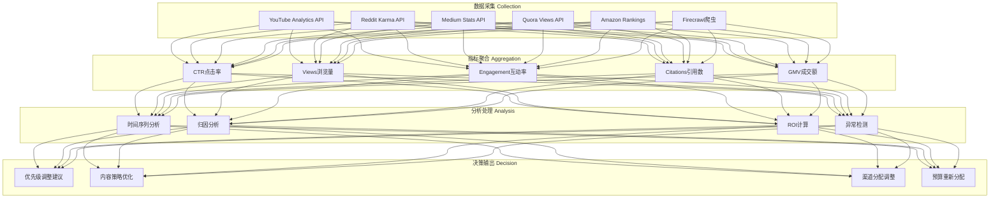

---

## 四、关键数据结构

### 4.1 Roadmap数据结构

```json
{
  "prompt": "best mattress for back pain",
  "month": "第1个月",
  "p_level": "P0",
  "enhanced_geo_score": 145,
  "quickwin_index": 0.85,
  "geo_intent_type": "Core-GEO-Intent",
  "ai_citation_eta": "1个月内",
  "ai_citation_prob": "极高",
  "content_strategy": "FAQ+专家答疑+视频教程",
  "geo_friendliness": "★★★★★",
  "content_hours_est": 8,
  "target_channels": ["官网Blog", "YouTube长讲解", "Reddit r/Mattress"],
  "expected_ctr": 3.2,
  "expected_gmv": 4500
}
```

### 4.2 Content Registry数据结构

```json
{
  "content_id": "FAQ-001",
  "covered_prompts": ["best mattress for back pain", "memory foam for back support"],
  "channel": "官网Blog",
  "publish_status": "已发布",
  "publish_url": "https://sweetnight.com/blog/best-mattress-back-pain",
  "publish_date": "2024-01-15",
  "kpi_ctr": 3.2,
  "kpi_views": 12000,
  "kpi_engagement": 0.45,
  "kpi_citations": 8,
  "kpi_gmv": 4500,
  "ai_indexing_status": "已收录",
  "last_update": "2024-02-01"
}
```

### 4.3 Citation Tracking数据结构

```json
{
  "citation_id": "CIT-2024-001",
  "source_platform": "YouTube",
  "source_url": "https://youtube.com/watch?v=xxx",
  "cited_content_id": "FAQ-001",
  "citation_type": "直接引用",
  "citation_context": "视频描述中引用",
  "discovered_date": "2024-02-10",
  "citation_status": "AI收录",
  "impact_score": 8.5,
  "attributed_prompts": ["best mattress for back pain"],
  "estimated_reach": 25000
}
```

---

## 五、系统集成架构

### 5.1 外部系统集成

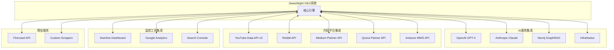

### 5.2 API接口设计

| API端点 | 方法 | 功能描述 | 输入参数 | 输出格式 |
|---------|------|----------|----------|----------|
| `/ingest/roadmap` | POST | 摄取月度路线图 | CSV/TSV文件 | JSON状态 |
| `/generate/backlog` | GET | 生成优先级待办 | month, p_level | Markdown |
| `/analyze/coverage` | GET | 分析内容覆盖 | prompt_list | JSON报告 |
| `/create/content` | POST | 生成内容资产 | prompt, template | 内容文本 |
| `/track/citation` | GET | 追踪引用状态 | content_id | JSON数组 |
| `/report/kpi` | GET | 获取KPI报告 | date_range | JSON/MD |

---

## 六、部署架构

### 6.1 部署拓扑图

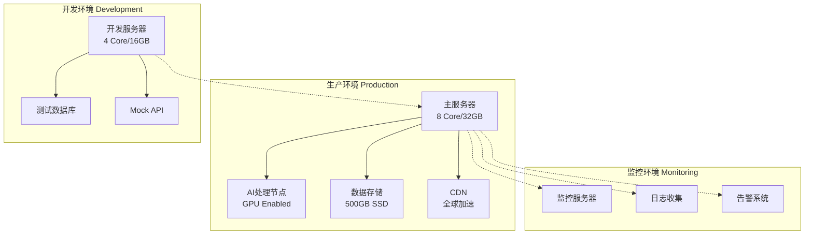

### 6.2 容量规划

| 组件 | 规格要求 | 扩展性 |
|------|----------|---------|
| **应用服务器** | 8 Core CPU, 32GB RAM | 水平扩展 |
| **AI处理** | GPU T4/V100, 16GB VRAM | 按需扩展 |
| **文件存储** | 500GB SSD, RAID 1 | 可扩展至2TB |
| **数据库** | PostgreSQL 14+, 100GB | 主从复制 |
| **缓存** | Redis 6+, 8GB | 集群模式 |
| **带宽** | 100Mbps上行 | CDN加速 |

---

## 七、安全架构

### 7.1 安全层级设计

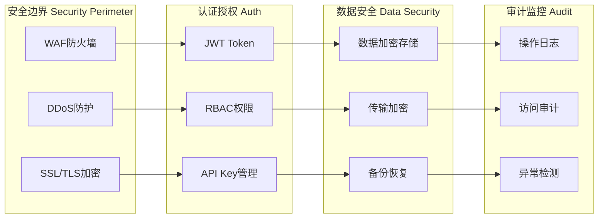

### 7.2 权限矩阵

| 角色 | 路线图管理 | 内容生成 | 引用追踪 | KPI查看 | 系统配置 |
|------|------------|----------|----------|---------|----------|
| **超级管理员** | ✅ | ✅ | ✅ | ✅ | ✅ |
| **运营经理** | ✅ | ✅ | ✅ | ✅ | ❌ |
| **内容编辑** | ❌ | ✅ | ✅ | ✅ | ❌ |
| **数据分析师** | ❌ | ❌ | ✅ | ✅ | ❌ |
| **访客** | ❌ | ❌ | ❌ | ✅ | ❌ |

---

## 八、性能优化架构

### 8.1 缓存策略

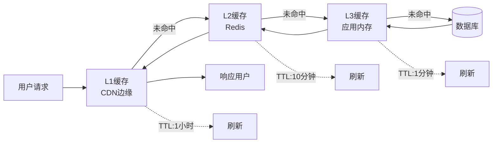

### 8.2 性能指标

| 指标项 | 目标值 | 监控方式 |
|--------|--------|----------|
| **API响应时间** | <200ms | P95延迟 |
| **内容生成时间** | <30秒 | 平均生成时间 |
| **引用更新延迟** | <5分钟 | 实时监控 |
| **系统可用性** | >99.9% | 健康检查 |
| **并发处理能力** | 1000 QPS | 压力测试 |

---

## 九、扩展性设计

### 9.1 微服务架构演进路径

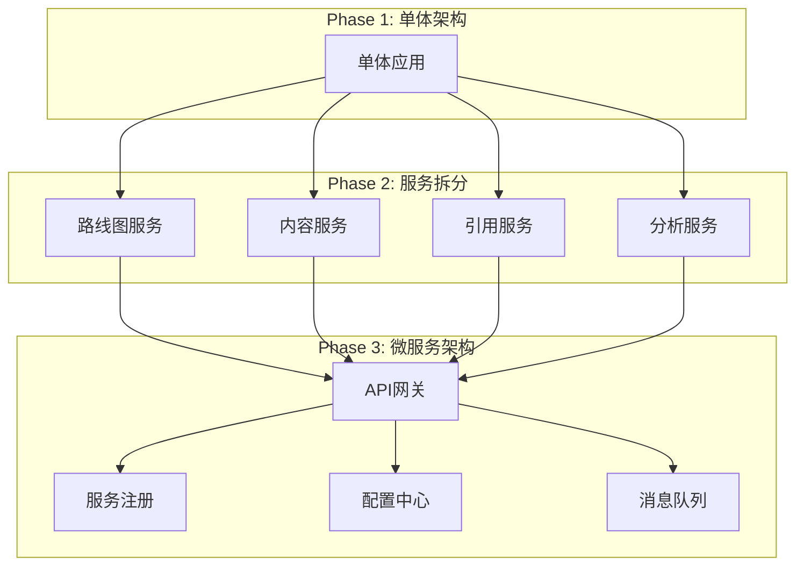

### 9.2 插件化扩展机制

| 扩展点 | 接口定义 | 扩展示例 |
|--------|----------|----------|
| **内容模板** | IContentTemplate | 新增Instagram模板 |
| **引用源** | ICitationSource | 集成TikTok |
| **AI引擎** | IAIProvider | 接入Gemini |
| **分析算法** | IAnalyzer | 自定义评分算法 |
| **报告格式** | IReporter | PDF导出器 |

---

## 十、灾备与恢复

### 10.1 备份策略

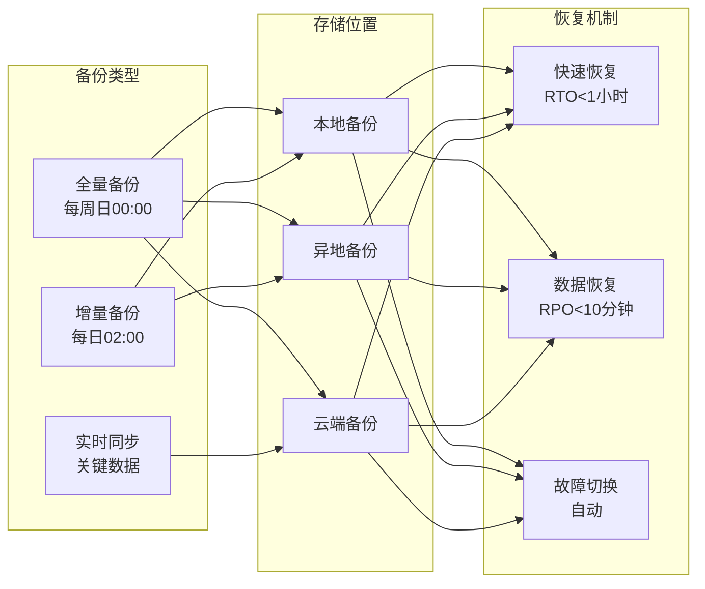

### 10.2 故障恢复流程

| 故障级别 | 影响范围 | RTO目标 | RPO目标 | 恢复流程 |
|----------|----------|---------|---------|----------|
| **P0-严重** | 全系统宕机 | 30分钟 | 5分钟 | 自动切换备用系统 |
| **P1-重要** | 核心功能故障 | 1小时 | 10分钟 | 热备切换 |
| **P2-一般** | 部分功能异常 | 4小时 | 30分钟 | 服务降级 |
| **P3-轻微** | 性能下降 | 24小时 | 1小时 | 计划维护 |

---

## 总结

SweetNight GEO战场感知态势分析作战系统采用分层架构设计，通过7步自动化工作流实现从路线图摄取到反馈优化的完整闭环。系统集成多个AI引擎和外部平台API，支持多渠道内容生成与分发，并通过实时KPI监控和引用追踪实现数据驱动的优化决策。

### 核心优势：
- 🎯 **精准定位**：P0-P3四级优先级体系，精确匹配GEO意图
- 🚀 **高效生产**：7种内容模板，覆盖全渠道发布需求
- 📊 **数据驱动**：实时KPI监控，AI引用率追踪
- 🔄 **闭环优化**：反馈分析自动调整内容策略
- 🛡️ **稳定可靠**：完善的安全架构和灾备机制

### 下一步行动：
1. 完成核心模块开发和集成测试
2. 部署生产环境并进行性能优化
3. 接入外部平台API并验证数据流
4. 启动首月试运行并收集反馈
5. 根据KPI表现持续优化算法模型