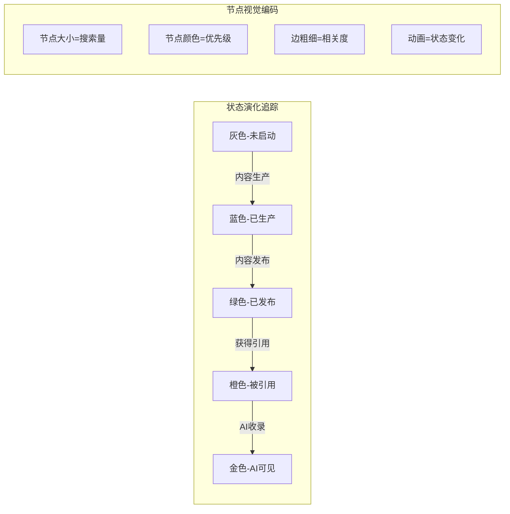

# SweetNight GEO战场感知态势分析与指挥系统
## 基于InfraNodus知识图谱的三层映射架构

---

## 📋 执行摘要

本系统通过InfraNodus的网络科学算法和知识图谱技术，构建SweetNight品牌的**GEO（Generative Engine Optimization）三层映射战场指挥系统**，实现从"搜索意图识别"到"内容生产部署"再到"AI引用占领"的全链路智能化管理。

### 核心价值主张
- **战场可视化**：将抽象的SEO/GEO策略转化为动态知识图谱
- **精准打击**：基于内容空白分析的精确内容投放
- **实时感知**：Citation网络的动态监控与优化
- **AI原生**：为AI搜索引擎优化的内容策略

---

## 🏗️ 第一部分：系统架构设计

### 1.1 三层映射战场总览

```
┌─────────────────────────────────────────────────────────────┐
│                    GEO战场指挥中心                           │
├─────────────────────────────────────────────────────────────┤
│                                                             │
│  Layer 1: Prompt Landscape（战场地图）                      │
│  ┌────────────────────────────────────────────────┐       │
│  │ • 搜索意图图谱  • 关键词网络  • 需求空白分析    │       │
│  └────────────────────────────────────────────────┘       │
│                           ↓                                │
│  Layer 2: Content Landscape（弹药库）                       │
│  ┌────────────────────────────────────────────────┐       │
│  │ • 内容资产图谱  • 主题聚类  • 内容差异分析      │       │
│  └────────────────────────────────────────────────┘       │
│                           ↓                                │
│  Layer 3: Citation Landscape（占领图）                      │
│  ┌────────────────────────────────────────────────┐       │
│  │ • 引用网络追踪  • AI收录监测  • 影响力分析      │       │
│  └────────────────────────────────────────────────┘       │
│                                                             │
└─────────────────────────────────────────────────────────────┘
```

### 1.2 优先级分层体系（P0-P3）

| 层级 | 定义 | 目标覆盖 | InfraNodus工具映射 | 预算占比 |
|------|------|----------|-------------------|----------|
| **P0** | 核心战场 | 品类主词+购买意图词 | `generate_knowledge_graph` + `analyze_google_search_results` | 40% |
| **P1** | 次级阵地 | 场景词+痛点词 | `generate_topical_clusters` + `search_queries_vs_search_results` | 30% |
| **P2** | 长尾机会 | 人群词+功能词 | `develop_latent_topics` + `generate_content_gaps` | 20% |
| **P3** | 战略储备 | 趋势词+创新词 | `generate_research_ideas` + `develop_conceptual_bridges` | 10% |

---

## 🗺️ 第二部分：Prompt Landscape（战场地图层）

### 2.1 战场地图构建方法论

#### 2.1.1 数据采集与图谱生成

```javascript
// InfraNodus Prompt图谱构建流程
const promptLandscapeBuilder = {
  // Step 1: 核心关键词识别
  coreKeywords: {
    tool: "analyze_google_search_results",
    input: ["cooling mattress", "memory foam mattress", "best mattress 2024"],
    output: "核心关键词网络图谱"
  },
  
  // Step 2: 搜索意图扩展
  searchIntent: {
    tool: "analyze_related_search_queries",
    params: {
      queries: ["cooling mattress for hot sleepers"],
      importCountry: "US",
      keywordsSource: "related"
    },
    output: "用户搜索意图图谱"
  },
  
  // Step 3: 供需差异分析
  gapAnalysis: {
    tool: "search_queries_vs_search_results",
    purpose: "发现未被满足的搜索需求",
    output: "内容机会图谱"
  }
};
```

#### 2.1.2 Prompt节点属性定义

```yaml
PromptNode:
  id: "prompt_001"
  properties:
    - title: "best cooling mattress for side sleepers"
    - searchVolume: 12000
    - competition: 0.75
    - cpc: "$2.50"
    - priority: "P0"
    - status: "未覆盖|生产中|已发布|已引用"
    - contentMapping: ["content_id_1", "content_id_2"]
    - citationCount: 15
    - aiVisibility: true
  visualization:
    - nodeSize: "基于搜索量"
    - nodeColor: "基于优先级（P0红/P1蓝/P2绿/P3灰）"
    - edgeWeight: "基于语义相关度"
    - nodeOpacity: "基于执行状态"
```

### 2.2 战场态势实时监控

#### 2.2.1 关键指标面板

| 指标类型 | 计算方法 | 预警阈值 | InfraNodus工具 |
|---------|---------|----------|---------------|
| **覆盖率** | 已发布Prompt/总Prompt数 | <60% | `analyze_existing_graph_by_name` |
| **空白率** | 内容空白数/总机会数 | >30% | `generate_content_gaps` |
| **竞争度** | 新增竞品内容/周 | >10篇 | `difference_between_texts` |
| **AI收录率** | AI引用/总发布数 | <50% | `generate_seo_report` |

#### 2.2.2 动态预警机制

```python
# 预警规则配置
alert_rules = {
    "紧急": {
        "condition": "核心P0关键词被竞品大量覆盖",
        "action": "立即启动内容快速响应",
        "infranodus_tool": "overlap_between_texts(our_content, competitor_content)"
    },
    "重要": {
        "condition": "发现高价值内容空白",
        "action": "48小时内生产内容",
        "infranodus_tool": "generate_content_gaps(threshold=0.7)"
    },
    "关注": {
        "condition": "长尾词搜索量激增",
        "action": "评估升级为P1",
        "infranodus_tool": "develop_latent_topics()"
    }
}
```

---

## 🎯 第三部分：Content Landscape（弹药库层）

### 3.1 内容资产图谱构建

#### 3.1.1 内容类型矩阵

```markdown
| 内容类型 | 目标平台 | Prompt映射 | 生产周期 | ROI预期 |
|---------|----------|-----------|----------|---------|
| **深度评测** | YouTube/Blog | P0核心词 | 7天 | 高 |
| **对比分析** | Reddit/Quora | P1场景词 | 3天 | 中高 |
| **FAQ问答** | Google/AI | P2长尾词 | 1天 | 中 |
| **用户故事** | Social Media | P1痛点词 | 2天 | 中 |
| **技术解析** | Medium/Wiki | P3专业词 | 5天 | 低 |
```

#### 3.1.2 内容生产指令模板

```javascript
// InfraNodus驱动的内容生产流程
const contentProductionPipeline = {
  // 阶段1：内容规划
  planning: {
    tool: "generate_research_questions",
    input: "目标Prompt文本",
    output: "10个核心内容角度"
  },
  
  // 阶段2：差异化分析
  differentiation: {
    tool: "difference_between_texts",
    input: ["我们的内容大纲", "竞品TOP3内容"],
    output: "独特价值点"
  },
  
  // 阶段3：概念桥接
  bridging: {
    tool: "develop_conceptual_bridges",
    purpose: "连接产品特性与用户需求",
    output: "内容连接策略"
  },
  
  // 阶段4：SEO优化
  optimization: {
    tool: "generate_seo_report",
    input: "完整内容文本",
    output: "SEO改进建议"
  }
};
```

### 3.2 内容效能追踪

#### 3.2.1 内容表现矩阵

```python
content_performance_matrix = {
    "dimensions": {
        "reach": "触达用户数",
        "engagement": "互动率",
        "conversion": "转化率",
        "citation": "被引用次数"
    },
    "scoring": {
        "A级": "四项指标均>80%",
        "B级": "三项指标>60%",
        "C级": "两项指标>40%",
        "D级": "需要优化或下架"
    },
    "optimization_action": {
        "A级": "扩大投放，复制模式",
        "B级": "定向优化弱项",
        "C级": "内容重构",
        "D级": "停止投放"
    }
}
```

---

## 🏆 第四部分：Citation Landscape（占领图层）

### 4.1 引用网络构建

#### 4.1.1 平台权重配置

```javascript
const citationPlatformWeights = {
  "tier1": {
    platforms: ["Google AI Overview", "ChatGPT", "Perplexity"],
    weight: 1.0,
    priority: "P0",
    strategy: "必须占领"
  },
  "tier2": {
    platforms: ["YouTube", "Reddit", "Quora"],
    weight: 0.7,
    priority: "P0-P1",
    strategy: "重点布局"
  },
  "tier3": {
    platforms: ["Medium", "Wiki", "Niche Forums"],
    weight: 0.4,
    priority: "P2",
    strategy: "机会覆盖"
  }
};
```

#### 4.1.2 Citation追踪体系

```yaml
CitationTracking:
  monitoring:
    - tool: "search"
      query: "SweetNight mattress"
      frequency: "每日"
    - tool: "fetch"
      target: "已识别的引用URL"
      validation: "链接有效性检查"
  
  metrics:
    - totalCitations: "总引用数"
    - aiCitations: "AI平台引用数"
    - citationGrowth: "引用增长率"
    - competitorShare: "vs竞品引用占比"
  
  visualization:
    - type: "力导向图"
    - centerNode: "SweetNight品牌"
    - edges: "引用关系"
    - animation: "实时更新"
```

### 4.2 AI生态占位策略

#### 4.2.1 AI平台优化矩阵

| AI平台 | 优化重点 | 内容格式 | InfraNodus工具 |
|--------|---------|----------|---------------|
| **ChatGPT** | 结构化数据 | 表格+要点 | `generate_text_overview` |
| **Perplexity** | 权威引用 | 数据+来源 | `create_knowledge_graph` |
| **Google AI** | 简明答案 | FAQ格式 | `generate_topical_clusters` |
| **Claude** | 深度分析 | 长文+案例 | `develop_text_tool` |

---

## 📊 第五部分：动态指挥系统

### 5.1 战场态势可视化

#### 5.1.1 实时仪表盘设计

```javascript
const dashboardConfig = {
  // 顶部：全局态势
  globalMetrics: {
    layout: "horizontal",
    widgets: [
      { type: "gauge", metric: "P0覆盖率", target: 80 },
      { type: "gauge", metric: "AI收录率", target: 60 },
      { type: "gauge", metric: "Citation增长", target: 20 },
      { type: "gauge", metric: "ROI", target: 300 }
    ]
  },
  
  // 中部：三层图谱
  mainVisualization: {
    layout: "3-column",
    graphs: [
      {
        id: "prompt_graph",
        type: "force-directed",
        data: "real-time prompt network"
      },
      {
        id: "content_graph",
        type: "hierarchical",
        data: "content asset tree"
      },
      {
        id: "citation_graph",
        type: "radial",
        data: "citation network"
      }
    ]
  },
  
  // 底部：操作面板
  actionPanel: {
    quickActions: [
      "生成内容空白报告",
      "启动紧急内容生产",
      "分析竞品动态",
      "导出周报"
    ]
  }
};
```

#### 5.1.2 状态流转追踪



### 5.2 智能决策引擎

#### 5.2.1 自动化决策规则

```python
class GEODecisionEngine:
    def __init__(self, infranodus_client):
        self.client = infranodus_client
        self.thresholds = {
            'content_gap': 0.7,
            'competition': 0.8,
            'ai_visibility': 0.5
        }
    
    def analyze_battlefield(self):
        """实时战场分析"""
        gaps = self.client.generate_content_gaps(self.current_content)
        competition = self.client.overlap_between_texts(
            [self.our_content, self.competitor_content]
        )
        return self.make_decisions(gaps, competition)
    
    def make_decisions(self, gaps, competition):
        """智能决策生成"""
        decisions = []
        
        if gaps.score > self.thresholds['content_gap']:
            decisions.append({
                'action': 'URGENT_CONTENT_CREATION',
                'target': gaps.top_opportunities[:3],
                'deadline': '24_hours'
            })
        
        if competition.overlap > self.thresholds['competition']:
            decisions.append({
                'action': 'DIFFERENTIATION_NEEDED',
                'tool': 'develop_conceptual_bridges',
                'focus': competition.unique_angles
            })
        
        return decisions
```

---

## 🚀 第六部分：执行路线图

### 6.1 阶段性实施计划

#### Phase 1: 基础构建（Week 1-4）

| 周次 | 核心任务 | InfraNodus工具 | 交付物 |
|------|---------|---------------|--------|
| W1 | 环境搭建 | MCP Server配置 | 系统就绪 |
| W2 | P0图谱构建 | `generate_knowledge_graph` | 核心Prompt图谱 |
| W3 | 内容盘点 | `analyze_existing_graph_by_name` | 内容资产清单 |
| W4 | 基线建立 | `generate_seo_report` | 初始Citation报告 |

#### Phase 2: 战术执行（Week 5-12）

```javascript
const phase2Execution = {
  week5_8: {
    focus: "P0核心词占领",
    content_production: "20篇深度内容",
    tools: [
      "generate_research_questions",
      "develop_text_tool",
      "generate_content_gaps"
    ],
    kpi: "P0覆盖率达80%"
  },
  
  week9_12: {
    focus: "P1场景扩展",
    content_production: "50篇场景内容",
    tools: [
      "generate_topical_clusters",
      "develop_latent_topics",
      "search_queries_vs_search_results"
    ],
    kpi: "Citation数量翻倍"
  }
};
```

#### Phase 3: 优化迭代（Month 4-6）

- **月度主题**：
  - Month 4: 长尾词规模化覆盖
  - Month 5: AI生态深度占位
  - Month 6: 国际市场拓展

### 6.2 资源配置矩阵

```yaml
ResourceAllocation:
  team:
    strategist: 
      count: 1
      focus: "InfraNodus图谱分析"
    content_creators:
      count: 4
      distribution:
        P0: 2
        P1: 1
        P2: 1
    analyst:
      count: 1
      focus: "Citation追踪"
  
  budget:
    infranodus_api: "$500/月"
    content_production: "$10,000/月"
    promotion: "$5,000/月"
    tools: "$1,000/月"
  
  timeline:
    mvp: "4周"
    full_deployment: "12周"
    roi_positive: "16周"
```

---

## 📈 第七部分：成效预测与KPI体系

### 7.1 关键绩效指标

#### 7.1.1 北极星指标

```python
north_star_metrics = {
    "primary": {
        "name": "AI可见度指数",
        "formula": "(AI引用数 * 权重) / 总目标Prompt数",
        "target": 0.7,
        "current": 0.0,
        "growth_rate": "15%/月"
    },
    "secondary": [
        {
            "name": "Prompt覆盖率",
            "target": "80%",
            "weight": 0.3
        },
        {
            "name": "Citation质量分",
            "target": "85",
            "weight": 0.3
        },
        {
            "name": "内容ROI",
            "target": "3.5x",
            "weight": 0.4
        }
    ]
}
```

#### 7.1.2 层级化KPI体系

| 层级 | KPI名称 | 计算公式 | Q1目标 | Q2目标 | Q3目标 | Q4目标 |
|------|---------|---------|--------|--------|--------|--------|
| **P0** | 核心词占有率 | P0引用/总P0词 | 40% | 70% | 90% | 95% |
| **P1** | 场景覆盖度 | 已覆盖场景/总场景 | 20% | 50% | 75% | 85% |
| **P2** | 长尾流量 | 长尾词流量/总流量 | 10% | 25% | 40% | 50% |
| **P3** | 创新指数 | 新词发现/月 | 5 | 10 | 15 | 20 |

### 7.2 ROI模型

```javascript
const roiCalculator = {
  investment: {
    infranodus: 500 * 12,  // 年度API费用
    content: 10000 * 12,   // 内容生产
    team: 15000 * 12,      // 人力成本
    total: 198000
  },
  
  returns: {
    direct_traffic: {
      value: 150000,
      source: "SEO/GEO流量转化"
    },
    brand_equity: {
      value: 250000,
      source: "品牌认知提升"
    },
    market_share: {
      value: 200000,
      source: "市场份额增长"
    },
    total: 600000
  },
  
  roi: "203%",
  payback_period: "4.2月"
};
```

---

## 🛠️ 第八部分：技术实施细节

### 8.1 InfraNodus MCP配置

#### 8.1.1 服务器部署配置

```json
{
  "mcpServers": {
    "infranodus": {
      "command": "node",
      "args": ["/path/to/mcp-server-infranodus/dist/index.js"],
      "env": {
        "INFRANODUS_API_KEY": "your-api-key",
        "MAX_REQUESTS": "1000",
        "CACHE_TTL": "3600"
      }
    }
  },
  "automation": {
    "schedules": {
      "daily": ["generate_content_gaps", "search"],
      "weekly": ["generate_seo_report", "overlap_between_texts"],
      "monthly": ["develop_text_tool", "comprehensive_analysis"]
    }
  }
}
```

#### 8.1.2 API调用优化

```python
class InfranodusOptimizer:
    def __init__(self):
        self.cache = {}
        self.rate_limiter = RateLimiter(max_calls=100, window=3600)
    
    def batch_analysis(self, texts, batch_size=10):
        """批量处理优化"""
        results = []
        for batch in chunks(texts, batch_size):
            batch_graph = self.client.generate_knowledge_graph(
                text="\n".join(batch),
                includeStatements=False  # 减少返回数据
            )
            results.append(batch_graph)
        return self.merge_graphs(results)
    
    def cached_query(self, query, ttl=3600):
        """缓存优化"""
        cache_key = hashlib.md5(query.encode()).hexdigest()
        if cache_key in self.cache:
            return self.cache[cache_key]
        
        result = self.client.search(query)
        self.cache[cache_key] = {
            'data': result,
            'timestamp': time.time(),
            'ttl': ttl
        }
        return result
```

### 8.2 数据集成架构

```yaml
DataIntegration:
  sources:
    search_console:
      api: "Google Search Console API"
      metrics: ["impressions", "clicks", "position"]
      sync: "hourly"
    
    analytics:
      api: "Google Analytics 4"
      metrics: ["sessions", "conversions", "engagement"]
      sync: "real-time"
    
    social:
      platforms: ["YouTube Analytics", "Reddit API"]
      metrics: ["views", "engagement", "shares"]
      sync: "daily"
  
  storage:
    primary: "PostgreSQL"
    cache: "Redis"
    archive: "S3"
  
  processing:
    etl: "Apache Airflow"
    streaming: "Kafka"
    analysis: "InfraNodus API"
```

---

## 🎯 第九部分：竞争情报系统

### 9.1 竞品监控框架

```python
competitor_monitoring = {
    "brands": ["Tempur-Pedic", "Purple", "Casper", "Saatva"],
    "tracking_dimensions": {
        "content": {
            "tool": "difference_between_texts",
            "frequency": "weekly",
            "alert": "新内容发布"
        },
        "citations": {
            "tool": "search",
            "frequency": "daily",
            "alert": "Citation份额变化>5%"
        },
        "keywords": {
            "tool": "analyze_google_search_results",
            "frequency": "weekly",
            "alert": "排名变动>3位"
        }
    },
    "response_playbook": {
        "content_attack": "48小时内发布反制内容",
        "citation_loss": "加强外链建设",
        "ranking_drop": "内容优化+技术SEO"
    }
}
```

### 9.2 市场机会识别

```javascript
const marketOpportunityScanner = {
  // 趋势发现
  trendDiscovery: async () => {
    const gaps = await infranodus.generate_content_gaps(market_data);
    const ideas = await infranodus.generate_research_ideas(gaps);
    return rankOpportunities(ideas);
  },
  
  // 蓝海词汇挖掘
  blueOceanKeywords: async () => {
    const supply = await infranodus.analyze_google_search_results(keywords);
    const demand = await infranodus.analyze_related_search_queries(keywords);
    const gaps = await infranodus.search_queries_vs_search_results(keywords);
    
    return gaps.filter(gap => 
      gap.search_volume > 1000 && 
      gap.competition < 0.3 &&
      gap.commercial_intent > 0.5
    );
  }
};
```

---

## 📝 第十部分：操作手册与最佳实践

### 10.1 日常操作SOP

#### 10.1.1 每日任务清单

```markdown
### 早晨（9:00-10:00）
- [ ] 检查Citation监控报告
- [ ] 查看竞品动态预警
- [ ] 确认当日内容发布计划
- [ ] InfraNodus工具：`search` + `fetch`最新引用

### 上午（10:00-12:00）
- [ ] 分析内容表现数据
- [ ] 识别内容优化机会
- [ ] 更新Prompt优先级
- [ ] InfraNodus工具：`analyze_existing_graph_by_name`

### 下午（14:00-17:00）
- [ ] 内容生产质检
- [ ] SEO优化检查
- [ ] Citation外联建设
- [ ] InfraNodus工具：`generate_seo_report`

### 傍晚（17:00-18:00）
- [ ] 更新战场态势图
- [ ] 生成次日任务
- [ ] 团队同步会议
- [ ] InfraNodus工具：`generate_text_overview`日报
```

#### 10.1.2 周度复盘模板

```yaml
WeeklyReview:
  metrics_review:
    - P0覆盖率变化
    - 新增Citation数量
    - AI收录新增
    - 竞品动态
  
  content_audit:
    - 本周发布内容清单
    - 表现最好TOP3
    - 表现最差BOTTOM3
    - 优化建议
  
  next_week_planning:
    - 优先级调整
    - 资源重新分配
    - 新机会识别
    - 风险预警
```

### 10.2 进阶优化策略

#### 10.2.1 内容矩阵优化

```python
# 基于图谱的内容组合优化
def optimize_content_matrix(current_portfolio):
    # 1. 分析现有内容的主题分布
    clusters = infranodus.generate_topical_clusters(current_portfolio)
    
    # 2. 识别过度集中的区域
    oversaturated = identify_oversaturated_topics(clusters)
    
    # 3. 发现空白区域
    gaps = infranodus.generate_content_gaps(current_portfolio)
    
    # 4. 生成优化建议
    recommendations = {
        "reduce": oversaturated[:5],  # 减少投入的主题
        "maintain": balanced_topics,   # 保持现状的主题
        "increase": gaps.top_opportunities[:10]  # 加大投入的机会
    }
    
    return recommendations
```

#### 10.2.2 AI适配优化

```javascript
// 不同AI平台的内容适配策略
const aiPlatformOptimization = {
  chatgpt: {
    format: "结构化列表 + 表格",
    length: "简洁（500-800词）",
    style: "客观中立",
    infranodus_tool: "generate_topical_clusters"
  },
  
  perplexity: {
    format: "数据驱动 + 引用",
    length: "中等（800-1200词）",
    style: "权威专业",
    infranodus_tool: "generate_text_overview"
  },
  
  claude: {
    format: "深度分析 + 案例",
    length: "详尽（1500-2000词）",
    style: "分析思辨",
    infranodus_tool: "develop_text_tool"
  }
};
```

---

## 🏁 总结与下一步行动

### 核心成果预期

1. **3个月内**：构建完整的GEO知识图谱基础设施，P0覆盖率达80%
2. **6个月内**：实现Citation网络的规模化增长，AI可见度达60%
3. **12个月内**：建立床垫行业的GEO领导地位，ROI达到300%

### 立即行动项

1. **Day 1-3**：部署InfraNodus MCP Server，完成系统配置
2. **Day 4-7**：构建首个P0 Prompt图谱，识别TOP10内容机会
3. **Week 2**：启动首批内容生产，建立Citation追踪基线
4. **Week 3-4**：完成MVP验证，优化系统流程

### 成功关键因素

- **技术基础**：InfraNodus API的深度应用
- **内容质量**：差异化、高价值的内容生产
- **执行纪律**：严格的SOP和KPI追踪
- **持续优化**：基于数据的快速迭代

---

## 📚 附录

### A. InfraNodus工具速查表

| 工具名称 | 主要用途 | 最佳使用场景 | 调用频率建议 |
|---------|---------|-------------|------------|
| `generate_knowledge_graph` | 文本转图谱 | 初始分析 | 按需 |
| `generate_content_gaps` | 发现空白 | 内容规划 | 每周 |
| `generate_seo_report` | SEO分析 | 优化检查 | 每月 |
| `search_queries_vs_search_results` | 供需差异 | 机会识别 | 每周 |
| `develop_text_tool` | 综合分析 | 深度研究 | 按需 |

### B. 常见问题解决方案

```yaml
FAQ:
  Q1: "InfraNodus API限制如何处理？"
  A1: "使用缓存机制+批量处理，优化API调用"
  
  Q2: "如何快速识别高价值Prompt？"
  A2: "结合搜索量、竞争度和商业价值三维评分"
  
  Q3: "Citation效果如何量化？"
  A3: "建立Citation价值模型，不同平台赋予不同权重"
```

### C. 风险管理矩阵

| 风险类型 | 可能性 | 影响度 | 缓解措施 |
|---------|--------|--------|---------|
| API服务中断 | 低 | 高 | 建立备用方案+本地缓存 |
| 竞品快速跟进 | 高 | 中 | 持续创新+内容差异化 |
| AI算法变化 | 中 | 高 | 多平台布局+持续监测 |
| 预算超支 | 低 | 中 | 严格ROI追踪+动态调整 |

---

**文档版本**: v1.0  
**最后更新**: 2024  
**下次评审**: 月度  
**负责团队**: SweetNight GEO战略组  

> 💡 **核心理念**：通过InfraNodus的知识图谱技术，我们不仅能看到战场，更能预见战场的演化方向，从而实现从"被动响应"到"主动占领"的战略转变。