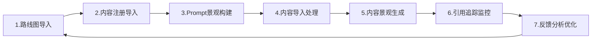
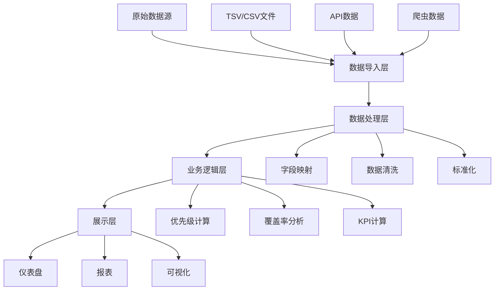

# SweetNight GEO战场感知态势分析作战系统
## 产品需求文档 (PRD) v1.0

---

## 1. 产品概述

### 1.1 产品定位
SweetNight GEO战场感知态势分析作战系统是一个专门为床垫品牌SweetNight设计的AI搜索引擎优化（GEO）管理平台。该系统通过自动化工作流和数据驱动的决策，帮助品牌在AI搜索时代获得更高的内容引用率和品牌曝光度。

### 1.2 核心价值主张
- **全方位态势感知**：实时监控7大内容平台的引用状况和竞争态势
- **智能化作战指挥**：基于P0-P3优先级体系自动调度内容生产资源
- **数据驱动决策**：通过Enhanced GEO Score和Quick Win Index双指标优化
- **闭环反馈机制**：7步自动化工作流实现从策略到执行的完整闭环

### 1.3 目标用户
- **主要用户**：SweetNight数字营销团队
- **次要用户**：内容创作团队、SEO专家、产品经理
- **决策层**：市场总监、CMO

---

## 2. 功能需求

### 2.1 核心功能模块

#### 2.1.1 战场态势感知模块

**功能描述**：实时监控和分析多平台内容表现与AI引用状况

**具体功能**：
- **多平台监控面板**
  - YouTube视频引用追踪
  - Reddit讨论热度分析
  - Medium文章收录状态
  - Quora问答采纳率
  - Amazon产品页面表现
  - 官方Blog内容索引率
  - LinkedIn B2B内容影响力

- **竞品分析仪表盘**
  - 竞品内容覆盖率对比
  - AI引用率排行榜
  - 关键词占有率分析
  - 内容质量评分对比

- **实时预警系统**
  - 引用率下降预警
  - 竞品内容突破预警
  - 平台政策变化提醒
  - KPI偏离预警

#### 2.1.2 作战指挥中心

**功能描述**：基于优先级系统进行内容战略规划和资源调度

**P-Level优先级管理**：
```
P0 (核心战场) - 权重100
├── 核心GEO意图关键词
├── AI引用概率 > 75%
├── 预期2个月内被收录
└── 资源投入：8小时/内容

P1 (重要战场) - 权重75
├── 高价值推荐类关键词
├── AI引用概率 50-75%
├── 预期3个月内被收录
└── 资源投入：6小时/内容

P2 (机会战场) - 权重50
├── 长尾关键词
├── AI引用概率 25-50%
├── 预期4-6个月被收录
└── 资源投入：4小时/内容

P3 (储备战场) - 权重25
├── 未来潜力关键词
├── AI引用概率 < 25%
├── 战略储备
└── 资源投入：3小时/内容
```

**智能调度功能**：
- 月度作战计划自动生成
- 资源分配优化建议
- 内容生产任务分发
- 进度跟踪与调整

#### 2.1.3 内容兵工厂

**功能描述**：标准化内容生产管理系统

**内容模板库**：
1. **YouTube脚本模板**
   - Hook开场（15秒）
   - 产品特性介绍
   - 对比测试环节
   - CTA行动号召

2. **Reddit回答模板**
   - 经验分享型
   - 数据对比型
   - 问题解决型

3. **Quora专业答案模板**
   - 决策框架型
   - 科学解释型
   - 买家指南型

4. **Medium长文模板**
   - 技术评测型
   - 材料科学型
   - 深度对比型

5. **FAQ/Blog模板**
   - 完整指南型
   - 常见问题型
   - 教育科普型

6. **Amazon PDP模板**
   - 5点卖点结构
   - A+内容框架
   - 评论回复模板

7. **LinkedIn B2B模板**
   - 合作案例型
   - 行业洞察型
   - 品牌故事型

**内容生产管理**：
- 模板变量自动填充
- 多语言版本管理（中英文）
- 内容审核工作流
- 版本控制与回滚

#### 2.1.4 战果统计与分析

**功能描述**：全方位数据分析和效果评估

**KPI追踪仪表盘**：
- **引用指标**
  - AI引用率（目标：P0达到60%+）
  - 引用增长率
  - 平台覆盖率
  
- **流量指标**
  - 点击率（CTR）
  - 页面浏览量
  - 用户停留时间
  
- **转化指标**
  - GMV贡献
  - 转化率
  - ROI计算

**报表生成器**：
- 执行摘要报告
- 内容覆盖率报告
- 引用追踪报告
- 竞品对比报告
- 风险评估报告

### 2.2 自动化工作流引擎

#### 7步自动化工作流程



**步骤详情**：

1. **路线图导入器**
   - 导入月度GEO路线图（TSV/CSV格式）
   - 自动识别24+字段
   - 生成优先级排序的任务清单

2. **内容注册导入器**
   - 导入现有内容库存
   - 创建Prompt↔Content映射关系
   - 识别内容覆盖缺口

3. **Prompt景观构建器**
   - 构建P0-P3分层架构
   - 计算Enhanced GEO Score
   - 分析Quick Win机会

4. **内容导入处理器**
   - 处理多格式内容（文本、视频、图片）
   - 标准化元数据
   - 建立知识图谱

5. **内容景观生成器**
   - 多渠道内容分发
   - 自动适配平台格式
   - 追踪发布状态

6. **引用追踪器**
   - 实时监控7大平台
   - 追踪引用链接
   - 记录引用上下文

7. **GEO反馈分析器**
   - 分析KPI表现
   - 调整优先级权重
   - 优化内容策略

---

## 3. 非功能性需求

### 3.1 性能需求
- **响应时间**：页面加载 < 2秒
- **数据更新**：实时数据延迟 < 5分钟
- **并发支持**：支持20+用户同时在线
- **数据处理**：支持10万+内容条目管理

### 3.2 可靠性需求
- **系统可用性**：99.5%以上
- **数据备份**：每日自动备份
- **故障恢复**：RTO < 4小时，RPO < 1小时
- **错误处理**：完善的异常捕获和日志记录

### 3.3 安全需求
- **访问控制**：基于角色的权限管理（RBAC）
- **数据加密**：传输加密（HTTPS）和存储加密
- **审计日志**：所有关键操作记录
- **API安全**：Token认证和速率限制

### 3.4 兼容性需求
- **浏览器支持**：Chrome 90+, Firefox 88+, Safari 14+
- **设备适配**：响应式设计，支持平板和手机
- **数据格式**：支持CSV, TSV, JSON, Markdown
- **编码支持**：UTF-8，完整中文支持

---

## 4. 数据需求

### 4.1 核心数据实体

```yaml
Roadmap:
  - month: 执行月份
  - prompt: 目标关键词
  - p_level: 优先级(P0-P3)
  - enhanced_geo_score: 增强GEO分数(0-150)
  - quickwin_index: 快赢指数
  - geo_intent_type: 意图分类
  - ai_citation_prob: AI引用概率
  - content_strategy: 内容策略
  - geo_friendliness: GEO友好度(★1-5)
  - content_hours_est: 预估工时

ContentRegistry:
  - content_id: 内容唯一标识
  - covered_prompts: 覆盖的关键词列表
  - channel: 发布渠道
  - publish_status: 发布状态
  - publish_url: 发布链接
  - kpi_ctr: 点击率
  - kpi_views: 浏览量
  - kpi_engagement: 互动率
  - kpi_gmv: GMV贡献

CitationTracking:
  - citation_id: 引用ID
  - source_platform: 来源平台
  - citation_url: 引用链接
  - cited_content_id: 被引用内容ID
  - citation_context: 引用上下文
  - citation_date: 引用日期
  - ai_indexed: AI收录状态
```

### 4.2 数据流转图



---

## 5. 界面设计需求

### 5.1 整体设计原则
- **设计语言**：Material Design 3.0
- **主题色**：深蓝(#1976D2) + 橙色(#FF6B35)
- **布局结构**：顶部导航 + 左侧菜单 + 主内容区
- **响应式**：支持1920x1080到移动端适配

### 5.2 核心页面

#### 5.2.1 指挥中心仪表盘
```
┌─────────────────────────────────────────────┐
│  Logo  │  指挥中心  │  用户  │  通知  │ 设置  │
├────────┼────────────────────────────────────┤
│        │  ┌──────────────────────────────┐  │
│  导航  │  │    实时态势感知地图         │  │
│  菜单  │  │  [P0][P1][P2][P3] 分布图    │  │
│        │  └──────────────────────────────┘  │
│  态势  │  ┌─────────┐ ┌─────────┐ ┌──────┐ │
│  指挥  │  │ AI引用率 │ │ 内容覆盖 │ │ GMV │ │
│  内容  │  │   45%   │ │   78%   │ │ $12K │ │
│  分析  │  └─────────┘ └─────────┘ └──────┘ │
│  报表  │  ┌──────────────────────────────┐  │
│        │  │     24小时引用趋势图         │  │
│        │  └──────────────────────────────┘  │
└────────┴────────────────────────────────────┘
```

#### 5.2.2 内容作战地图
- **地图视图**：显示关键词战场分布
- **热力图**：展示竞争激烈程度
- **时间轴**：显示内容发布和引用时间线
- **筛选器**：按P-Level、平台、状态筛选

### 5.3 交互设计
- **拖拽操作**：支持任务卡片拖拽调整优先级
- **批量操作**：支持多选批量处理
- **快捷键**：常用操作快捷键支持
- **实时更新**：WebSocket推送实时数据

---

## 6. 集成需求

### 6.1 外部系统集成

| 系统名称 | 集成方式 | 用途 | 优先级 |
|---------|---------|------|-------|
| Firecrawl API | REST API | 网页爬虫和引用追踪 | P0 |
| Neo4j GraphRAG | Graph API | 知识图谱构建 | P0 |
| InfraNodus | API | 文本网络分析 | P1 |
| YouTube API | OAuth 2.0 | 视频数据获取 | P0 |
| Reddit API | OAuth | 讨论数据抓取 | P1 |
| OpenAI API | REST API | 内容生成辅助 | P2 |

### 6.2 内部系统对接
- **Swinline Dashboard**：性能监控数据同步
- **Leap GEO Writer**：内容生成工具集成
- **MinIO存储**：文件和媒体资源管理
- **PostgreSQL**：核心业务数据存储

---

## 7. 实施计划

### 7.1 开发阶段

**Phase 1: MVP版本（4周）**
- Week 1-2: 核心数据模型和API开发
- Week 3: 基础仪表盘和态势感知
- Week 4: P-Level管理和基础报表

**Phase 2: 功能完善（6周）**
- Week 5-6: 7步自动化工作流
- Week 7-8: 多平台引用追踪
- Week 9-10: 内容模板和生成器

**Phase 3: 优化迭代（4周）**
- Week 11-12: 性能优化和测试
- Week 13-14: 用户反馈和迭代

### 7.2 技术栈

**前端技术栈**：
- React 18 + TypeScript
- Material-UI v5
- D3.js (数据可视化)
- Redux Toolkit (状态管理)
- React Query (数据同步)

**后端技术栈**：
- Node.js + Express/NestJS
- PostgreSQL (主数据库)
- Redis (缓存)
- Neo4j (图数据库)
- Bull Queue (任务队列)

**基础设施**：
- Docker容器化部署
- GitHub Actions CI/CD
- MinIO对象存储
- Nginx反向代理

---

## 8. 成功标准

### 8.1 业务指标
- **AI引用率提升**：3个月内P0关键词达到60%引用率
- **内容覆盖率**：覆盖80%以上的目标关键词
- **GMV贡献**：月度GMV增长20%
- **工作效率**：内容生产效率提升50%

### 8.2 技术指标
- **系统稳定性**：正常运行时间99.5%+
- **响应速度**：95%请求响应时间<1秒
- **数据准确性**：引用追踪准确率95%+
- **自动化率**：70%以上任务自动完成

### 8.3 用户满意度
- **易用性评分**：8/10以上
- **功能完整性**：覆盖90%用户需求
- **培训时间**：新用户2小时内上手
- **问题解决率**：24小时内解决90%问题

---

## 9. 风险与对策

### 9.1 技术风险
| 风险项 | 影响等级 | 缓解措施 |
|-------|---------|---------|
| API限流 | 高 | 实施请求缓存和队列管理 |
| 数据同步延迟 | 中 | 使用CDC和实时流处理 |
| 爬虫被封 | 高 | 多IP轮换和请求频率控制 |

### 9.2 业务风险
| 风险项 | 影响等级 | 缓解措施 |
|-------|---------|---------|
| AI算法变化 | 高 | 建立算法监控和快速适配机制 |
| 竞品模仿 | 中 | 持续创新和差异化功能 |
| 内容质量下降 | 高 | 严格审核流程和质量评分体系 |

---

## 10. 附录

### 10.1 术语表
- **GEO (Generative Engine Optimization)**：生成式引擎优化
- **P-Level**：优先级等级系统(P0最高)
- **Enhanced GEO Score**：增强型GEO评分算法
- **Quick Win Index**：快速制胜机会指数
- **Citation**：AI搜索引擎的内容引用

### 10.2 参考资料
- 项目代码库：`/users/cavin/desktop/dev/leapgeo4/`
- 配置文件：`field_mapping.json`, `prioritization_rules.json`
- 模板文档：`templates_content_templates.md`, `templates_report_templates.md`
- 工作流定义：`skill.json`

### 10.3 联系方式
- 产品负责人：[待定]
- 技术负责人：[待定]
- 项目管理：[待定]

---

**文档版本历史**
| 版本 | 日期 | 作者 | 更改说明 |
|-----|------|------|---------|
| 1.0 | 2025-01-20 | System | 初始版本创建 |

---

*本文档基于SweetNight GEO项目现有架构和需求整理，将持续更新优化。*